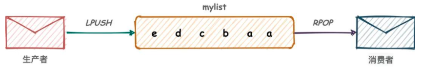
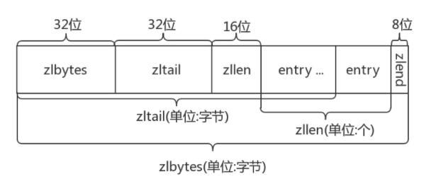
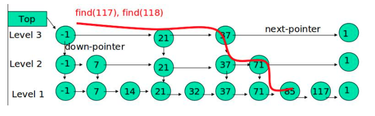

# Redis

 (1) (1).png>)

### 一、Redis基础概念

Redis（Remote Dictionary Server ，远程字典服务)是现在最受欢迎的NoSQL数据库之一，Redis是一个使用ANSI C编写的开源、包含多种数据结构、支持网络、基于内存、可选持久性的键值对存储数据库，具有丰富的应用场景，例如：缓存系统（“热点”数据：高频读、低频写）、计数器、消息队列系统、排行榜、社交网络和实时系统。其具备如下特性：

* 基于内存运行，性能高效
* 支持分布式，理论上可以无限扩展
* key-value存储系统
* 开源的使用ANSI C语言编写、遵守BSD协议、支持网络、可基于内存亦可持久化的日志型、Key-Value数据库，并提供多种语言的AP

相比于其他数据库类型，Redis具备的特点是：

* C/S通讯模型
* 单进程单线程模型
* 丰富的数据类型
* 操作具有原子性
* 持久化
* 高并发读写
* 支持lua脚本

#### Mac环境Redis安装

* 搜索Redis安装包

```shell
(base) B000000348954H:~ liwantao$ brew search redis
==> Formulae
hiredis                   redis ✔                   redis-leveldb             redis@3.2                 redis@4.0 ✔
==> Casks
another-redis-desktop-manager               redis                                       redisinsight

```

* 安装 Redis 4.0 版本

```
brew install redis@4.0
```

* 配置 Redis configure文件：/usr/local/etc 下修改redis.config找到

> daemonize no改成yes 以守护进程的方式启动

* 配置环境变量

```
vim ~/.bash_profile
```

&#x20;     添加如下内容：

```
export PATH="/usr/local/opt/redis@4.0/bin:$PATH"
```

* 启动 Redis Server

```
brew services start redis@4.0
```

&#x20;   或者

```
redis-server /usr/local/etc/redis.conf
```

* 连接 Redis 客户端（Client）：`redis-cli -h host -p port`

```
redis-cli -h 127.0.0.1 -p 6379
```

* 关闭 Redis 客户端

```
redis-cli shutdown
```


### 二、Redis数据结构

Redis支持多种类型的数据结构，如:

* 二进制安全的字符串
* Lists: 按插入顺序排序的字符串元素的集合。他们基本上就是_链表（linked lists）_。
* Sets: 不重复且无序的字符串元素的集合。
* Sorted sets,类似Sets,但是每个字符串元素都关联到一个叫_score_浮动数值（floating number value）。里面的元素总是通过score进行着排序，所以不同的是，它是可以检索的一系列元素。（例如你可能会问：给我前面10个或者后面10个元素）。
* Hashes,由field和关联的value组成的map。field和value都是字符串的。这和Ruby、Python的hashes很像。
* Bit arrays (或者说 simply bitmaps): 通过特殊的命令，你可以将 String 值当作一系列 bits 处理：可以设置和清除单独的 bits，数出所有设为 1 的 bits 的数量，找到最前的被设为 1 或 0 的 bit，等等。
* HyperLogLogs: 这是被用于估计一个 set 中元素数量的概率性的数据结构。

Redis的数据结构如下图所示：


#### 2.1 Redis keys

Redis key值是二进制安全的，这意味着可以用任何二进制序列作为key值，从形如”foo”的简单字符串到一个JPEG文件的内容都可以。空字符串也是有效key值。

关于key的几条规则：

* 不建议太长的健值，因为不仅消耗内存，而且在数据中查找这类键值的计算成本很高。
* 保证可读性，如果你要用”u:1000:pwd”来代替”user:1000:password”，这没有什么问题，但后者更易阅读，并且由此增加的空间消耗相对于key object和value object本身来说很小。
* 最好坚持一种模式。例如使用":"或"."分隔

支持的命令：

| Redis命令                                                                   | RedisTemplate                                                                                                             |                 说明                |
| ------------------------------------------------------------------------- | ------------------------------------------------------------------------------------------------------------------------- | :-------------------------------: |
| `KEYS *、KEYS *key*、KEYS *key、KEYS key*`                                   | `redisTemplate.keys(key);`                                                                                                |     获取所有key，模糊查询_key_（支持通配符\*）    |
| <p><code>EXPIRE key 10</code><br><code>EXPIREAT key 1293840000</code></p> | <p><code>redisTemplate.expire(key, time, TimeUnit.SECONDS);</code><br><code>redisTemplate.expireAt(key, date);</code></p> | <p>指定key缓存失效时间<br>指定key缓存到期时间</p> |
| `TTL key`                                                                 | `redisTemplate.getExpire(key, TimeUnit.SECONDS);`                                                                         |            根据key获取过期时间            |
| <p><code>EXISTS key</code><br><code>EXISTS key1 key2 key3</code></p>      | <p><code>redisTemplate.hasKey(key);</code><br><code>redisTemplate.countExistingKeys(Arrays.asList(key));</code></p>       |   <p>判断key是否存在<br>检查key存在的数量</p>  |
| <p><code>DEL key</code><br><code>DEL key1 key2 key3</code></p>            | <p><code>redisTemplate.delete(key);</code><br><code>redisTemplate.delete(Arrays.asList(keys));</code></p>                 |    <p>删除指定key缓存<br>批量删除key</p>    |

#### 2.2 Redis Strings <a href="#redis-strings" id="redis-strings"></a>

这是最简单Redis类型。如果你只用这种类型，Redis就像一个可以持久化的memcached服务器（注：memcache的数据仅保存在内存中，服务器重启后，数据将丢失）。它是一个二进制安全的字符串，意味着它不仅能够存储字符串、还能存储图片、视频等多种类型, 最大长度支持512M。

支持的命令：

| Redis命令                                                              | RedisTemplate                                                                                                                    | 说明                                             |
| -------------------------------------------------------------------- | -------------------------------------------------------------------------------------------------------------------------------- | ---------------------------------------------- |
| <p><code>SET key value</code><br><code>SET key value time</code></p> | <p><code>redisTemplate.opsForValue().set(key,value);</code><br><code>redisTemplate.opsForValue().set(key,value,time);</code></p> | <p>设置普通缓存<br>设置普通缓存过期时间</p>                    |
| `GET key`                                                            | `redisTemplate.opsForValue().get(key);`                                                                                          | 获取普通缓存                                         |
| `INCE key`                                                           | `redisTemplate.opsForValue().increment(key, delta);`                                                                             | 递增                                             |
| `DECR key`                                                           | `redisTemplate.opsForValue().increment(key, -delta);`                                                                            | 递减                                             |
| `SETNX key value`                                                    | `redisTemplate.opsForValue().setIfAbsent(key,value);`                                                                            | 将 key 的值设为 value ，当且仅当 key 不存在                 |
| `SETEX key value`                                                    | `redisTemplate.opsForValue().setIfPresent(key,value);`                                                                           | 判断当前的键的值是否为v，是的话不作操作，不实的话进行替换。如果没有这个键也不会做任何操作。 |
| `GETSET key value`                                                   | `redisTemplate.opsForValue().getAndSet(key, value);`                                                                             | key存在设置新值，并返回旧值                                |

****

基于C语言中传统字符串的缺陷**(**因为 `char*` 类型的功能单一， 抽象层次低， 并且不能高效地支持一些 Redis 常用的操作，比如追加操作和长度计算操作**)**，Redis自己构建了一种名为简单动态字符串的抽象类型，简称SDS，其结构如下：

```c
typedef char *sds;


struct sdshdr {

    // buf 已占用长度
    int len;

    // buf 剩余可用长度
    int free;

    // 实际保存字符串数据的地方
    char buf[];
};
```

其中，类型 `sds` 是 `char *` 的别名（alias），而结构 `sdshdr` 则保存了 `len` 、 `free` 和 `buf` 三个属性。通过 `len` 属性， `sdshdr` 可以实现复杂度为 O(1) 的长度计算操作。另一方面， 通过对 `buf` 分配一些额外的空间， 并使用 `free` 记录未使用空间的大小， `sdshdr` 可以让执行追加操作所需的内存重分配次数大大减少。


#### 2.3 Redis Lists

Redis lists基于Linked Lists实现，这意味着即使在一个list中有数百万个元素，在头部或尾部添加一个元素的操作，其时间复杂度也是常数级别的。用LPUSH 命令在十个元素的list头部添加新元素，和在千万元素list头部添加新元素的速度相同。

| Redis命令                | RedisTemplate                                           | 说明               |
| ---------------------- | ------------------------------------------------------- | ---------------- |
| `RPUSH key value`\`    | `redisTemplate.opsForList().rightPush(key, value);`     | 将list放入缓存,从右边添加  |
| `LPUSH key value`      | `redisTemplate.opsForList().leftPush(key, value);`      | 将list放入缓存,从左边添加  |
| `LRANGE key 0 -1`      | `redisTemplate.opsForList().range(key, start, end);`    | 获取list缓存的内容      |
| `LLEN key`             | `redisTemplate.opsForList().size(key);`                 | 获取list缓存的长度      |
| `LINDEX key index`     | `redisTemplate.opsForList().index(key, index);`         | 通过索引 获取list中的值   |
| `LSET key index value` | `redisTemplate.opsForList().set(key, index, value);`    | 根据索引修改list中的某条数据 |
| `LREM key count value` | `redisTemplate.opsForList().remove(key, count, value);` | 移除N个值为value      |


基于Redis Lists可以实现消息队列，将需要延后处理的任务结构体序列化成字符串塞进 Redis 的列表，另一个线程从这个列表中轮询数据进行处理。



通过 LPUSH，RPOP 这样的方式，会存在一个性能风险点，就是消费者如果想要及时的处理数据，就要在程序中写个类似 while(true) 这样的逻辑，不停的去调用 RPOP 或 LPOP 命令，这就会给消费者程序带来些不必要的性能损失。

所以，Redis 还提供了 BLPOP、BRPOP 这种阻塞式读取的命令(带 B-Bloking的都是阻塞式)，客户端在没有读到队列数据时，自动阻塞，直到有新的数据写入队列，再开始读取新数据。这种方式就节省了不必要的 CPU 开销。


#### 2.4 Redis Sets

Set类型是一种无顺序集合, 它和List类型最大的区别是：集合中的元素没有顺序, 且元素是唯一的，Set类型的底层是通过哈希表实现的。

| Redis命令                   | RedisTemplate                                                  | 说明                    |
| ------------------------- | -------------------------------------------------------------- | --------------------- |
| `SMEMBEredisTemplate key` | `redisTemplate.opsForedisTemplateet().memberedisTemplate(key)` | 根据key获取Set中的所有值       |
| `SISMEMBER key value`     | `redisTemplate.opsForedisTemplateet().isMember(key, value);`   | 根据value从一个set中查询,是否存在 |
| `SADD key value1 value2`  | `redisTemplate.opsForedisTemplateet().add(key, values);`       | 将数据放入set缓存            |
| `SCARD key`               | `redisTemplate.opsForedisTemplateet().size(key);`              | 获取set缓存的长度            |
| `SREM key value1 value2`  | `redisTemplate.opsForedisTemplateet().remove(key, values);`    | 移除值为value的            |


#### 2.5 Redis Hashes

该类型是由field和关联的value组成的map。其中，field和value都是字符串类型的。

| Redis命令                             | RedisTemplate                                           | 说明                             |
| ----------------------------------- | ------------------------------------------------------- | ------------------------------ |
| `HMSET key key1 value1 key2 value2` | `redisTemplate.opsForHash().putAll(key, map);`          | 设置缓存                           |
| `HSET key item value`               | `redisTemplate.opsForHash().put(key, item, value);`     | 向一张hash表中放入数据,如果不存在将创建         |
| `HGET key item`                     | `redisTemplate..opsForHash().get(key, item);`           | 获取缓存，字段值                       |
| `HMGET key`                         | `redisTemplate.opsForHash().entries(key);`              | 获取hashKey对应的所有键值               |
| `DELETE key item1 item2 item3`      | `redisTemplate.opsForHash().delete(key, item);`         | 将 key 的值设为 value ，当且仅当 key 不存在 |
| `HEXISTS key item`                  | `redisTemplate.opsForHash().hasKey(key, item);`         | 判断hash表中是否有该项的值                |
| `HINCRBY key item by`               | `redisTemplate.opsForHash().increment(key, item, by);`  | hash递增 如果不存在,就会创建一个 并把新增后的值返回  |
| `HDEL key item by`                  | `redisTemplate.opsForHash().increment(key, item, -by);` | hash递减                         |


#### 2.6 Redis Sorted sets

ZSet是一种有序集合类型，每个元素都会关联一个double类型的分数权值，通过这个权值来为集合中的成员进行从小到大的排序。sorted set与set结构一样均不允许重复的元素，但与set不同的是sorted set除了member(元素)之外，每个member都会关联一个分数score。sorted set根据score对元素进行升序排列，如果有多个元素的分数相同，那么按照member的字典序升序排列，sorted set中元素不允许相同，但score允许相同。

适用场景：

* 排行榜，以用户id为member，充值总金额或得分作为score，那么就可以得到排行榜，但是需要注意的是sorted set是升序排列的，所以如果想要取前10的话，需要从最后一个元素开始。&#x20;
* 消息延迟发送，将消息体作为member，发送时间戳以score的形式存储，通过定时任务扫描sorted set，对score小于等于当前时间的score对应的消息体进行发送。&#x20;

sorted set有两种实现方式，一种是ziplist压缩表，一种是zset(dict、skiplist)，redis.conf有两个配置来控制，当sorted set中的元素个数小于128时(即元素对member score的个数，共256个元素)，使用ziplist，当元素对中member长度超过64个字节时使用zset。

| zset-max-ziplist-entries | 128 |
| ------------------------ | --- |
| zset-max-ziplist-value   | 64  |


（1）ziplist

Redis是基于内存的nosql，有些场景下为了节省内存redis会用“时间”换“空间”，ziplist就是很典型的例子。ziplist是由_**一系列特殊编码的连续内存块组成的顺序存储结构**_，类似于数组，ziplist在内存中是连续存储的，但是不同于数组，为了节省内存 ziplist的每个元素所占的内存大小可以不同（数组中叫元素，ziplist叫节点**entry**，下文都用“节点”），每个节点可以用来存储一个整数或者一个字符串。\
下图是ziplist在内存中的布局：



* zlbytes: ziplist的长度（单位: 字节)，是一个32位无符号整数
* zltail: ziplist最后一个节点的偏移量，反向遍历ziplist或者pop尾部节点的时候有用。
* zllen: ziplist的节点（entry）个数
* entry: 节点
* zlend: 值为0xFF，用于标记ziplist的结尾


（2）skiplist

跳表是一种随机化的数据结构，目前开源软件 Redis 和 LevelDB 都有用到它，它的效率和红黑树以及 AVL 树不相上下，但跳表的原理相当简单，只要你能熟练操作链表，就能轻松实现一个 SkipList。

跳表本质上是对链表的一种优化，通过逐层跳步采样的方式构建索引，以加快查找速度。如果只用普通链表，只能一个一个往后找。跳表就不一样了，可以高层索引，一次跳跃多个节点，如果找过头了，就用更下层的索引。



使用概率均衡的思路，确定新插入节点的层数。Redis使用随机函数决定层数。直观上来说，默认1层，和丢硬币一样，如果是正面就继续往上，这样持续迭代，最大层数32层。可以看到，50%的概率被分配到第一层，25%的概率被分配到第二层，12.5%的概率被分配到第三层。这种方式保证了越上层数量越少，自然跨越起来越方便。


#### 2.7 3种特殊类型

（1）HyperLogLogs（基数统计）

* **什么是基数？**

举个例子，A = {1, 2, 3, 4, 5}， B = {3, 5, 6, 7, 9}；那么基数（不重复的元素）= 1, 2, 4, 6, 7, 9； （允许容错，即可以接受一定误差）

* **HyperLogLogs 基数统计用来解决什么问题**？

这个结构可以非常省内存的去统计各种计数，比如注册 IP 数、每日访问 IP 数、页面实时UV、在线用户数，共同好友数等。

* **它的优势体现在哪**？

一个大型的网站，每天 IP 比如有 100 万，粗算一个 IP 消耗 15 字节，那么 100 万个 IP 就是 15M。而 HyperLogLog 在 Redis 中每个键占用的内容都是 12K，理论存储近似接近 2^64 个值，不管存储的内容是什么，它一个基于基数估算的算法，只能比较准确的估算出基数，可以使用少量固定的内存去存储并识别集合中的唯一元素。而且这个估算的基数并不一定准确，是一个带有 0.81% 标准错误的近似值（对于可以接受一定容错的业务场景，比如IP数统计，UV等，是可以忽略不计的）。

* **相关命令使用**

```shell
127.0.0.1:6379> pfadd key1 a b c d e f g h i	# 创建第一组元素
(integer) 1
127.0.0.1:6379> pfcount key1					# 统计元素的基数数量
(integer) 9
127.0.0.1:6379> pfadd key2 c j k l m e g a		# 创建第二组元素
(integer) 1
127.0.0.1:6379> pfcount key2
(integer) 8
127.0.0.1:6379> pfmerge key3 key1 key2			# 合并两组：key1 key2 -> key3 并集
OK
127.0.0.1:6379> pfcount key3
(integer) 13
  
```


（2）Bitmap （位存储）

> Bitmap 即位图数据结构，都是操作二进制位来进行记录，只有0 和 1 两个状态。

* **用来解决什么问题**？

比如：统计用户信息，活跃，不活跃！ 登录，未登录！ 打卡，不打卡！ **两个状态的，都可以使用 Bitmaps**！

如果存储一年的打卡状态需要多少内存呢？ 365 天 = 365 bit 1字节 = 8bit 46 个字节左右！

* **相关命令使用**

使用bitmap 来记录 周一到周日的打卡！ 周一：1 周二：0 周三：0 周四：1 ......

```
127.0.0.1:6379> setbit sign 0 1
(integer) 0
127.0.0.1:6379> setbit sign 1 1
(integer) 0
127.0.0.1:6379> setbit sign 2 0
(integer) 0
127.0.0.1:6379> setbit sign 3 1
(integer) 0
127.0.0.1:6379> setbit sign 4 0
(integer) 0
127.0.0.1:6379> setbit sign 5 0
(integer) 0
127.0.0.1:6379> setbit sign 6 1
(integer) 0

```

查看某一天是否有打卡！

```
127.0.0.1:6379> getbit sign 3
(integer) 1
127.0.0.1:6379> getbit sign 5
(integer) 0
```

统计操作，统计 打卡的天数！

```
127.0.0.1:6379> bitcount sign # 统计这周的打卡记录，就可以看到是否有全勤！
(integer) 3
    
```


（3）geospatial (地理位置)

> Redis 的 Geo 在 Redis 3.2 版本就推出了! 这个功能可以推算地理位置的信息: 两地之间的距离, 方圆几里的人

* **geoadd**

> 添加地理位置

```
127.0.0.1:6379> geoadd china:city 118.76 32.04 manjing 112.55 37.86 taiyuan 123.43 41.80 shenyang
(integer) 3
127.0.0.1:6379> geoadd china:city 144.05 22.52 shengzhen 120.16 30.24 hangzhou 108.96 34.26 xian
(integer) 3  
```

* **规则**

两级无法直接添加，我们一般会下载城市数据(这个网址可以查询 GEO： http://www.jsons.cn/lngcode)！

* 有效的经度从-180度到180度。
* 有效的纬度从-85.05112878度到85.05112878度。

```
# 当坐标位置超出上述指定范围时，该命令将会返回一个错误。
127.0.0.1:6379> geoadd china:city 39.90 116.40 beijin
(error) ERR invalid longitude,latitude pair 39.900000,116.400000
```

####

#### 2.8 Redis特性

（1）事务

Redis 事务的本质是一组命令的集合。事务支持一次执行多个命令，一个事务中所有命令都会被序列化。在事务执行过程，会按照顺序串行化执行队列中的命令，其他客户端提交的命令请求不会插入到事务执行命令序列中。总结说：redis事务就是一次性、顺序性、排他性的执行一个队列中的一系列命令。

**Redis事务没有隔离级别的概念：**

　　批量操作在发送 EXEC 命令前被放入队列缓存，并不会被实际执行，也就不存在事务内的查询要看到事务里的更新，事务外查询不能看到。

**Redis不保证原子性：**

　　Redis中，单条命令是原子性执行的，但事务不保证原子性，且没有回滚。事务中任意命令执行失败，其余的命令仍会被执行。

**Redis事务的三个阶段：**

* 开始事务
* 命令入队
* 执行事务

**Redis事务相关命令：**

* watch key1 key2 ... : 监视一或多个key,如果在事务执行之前，被监视的key被其他命令改动，则事务被打断 （ 类似乐观锁 ）
* multi : 标记一个事务块的开始（ queued ）
* exec : 执行所有事务块的命令 （ 一旦执行exec后，之前加的监控锁都会被取消掉 ）　
* discard : 取消事务，放弃事务块中的所有命令
* unwatch : 取消watch对所有key的监控


**如何理解Redis与事务的ACID？**

> 一般来说，事务有四个性质称为ACID，分别是原子性，一致性，隔离性和持久性。

* 原子性atomicity

首先通过上文知道 运行期的错误是不会回滚的，很多文章由此说Redis事务违背原子性的；而官方文档认为是遵从原子性的。Redis官方文档给的理解是，Redis的事务是原子性的：所有的命令，要么全部执行，要么全部不执行。而不是完全成功。

* 一致性consistency

redis事务可以保证命令失败的情况下得以回滚，数据能恢复到没有执行之前的样子，是保证一致性的，除非redis进程意外终结。

* 隔离性Isolation

redis事务是严格遵守隔离性的，原因是redis是单进程单线程模式(v6.0之前），可以保证命令执行过程中不会被其他客户端命令打断。但是，Redis不像其它结构化数据库有隔离级别这种设计。

* 持久性Durability

redis事务是不保证持久性的，这是因为redis持久化策略中不管是RDB还是AOF都是异步执行的，不保证持久性是出于对性能的考虑。

&#x20;**Redis事务其它实现**

* 基于Lua脚本，Redis可以保证脚本内的命令一次性、按顺序地执行，其同时也不提供事务运行错误的回滚，执行过程中如果部分命令运行错误，剩下的命令还是会继续运行完
* 基于中间标记变量，通过另外的标记变量来标识事务是否执行完成，读取数据时先读取该标记变量判断是否事务执行完成。但这样会需要额外写代码实现，比较繁琐


（2）发布订阅

Redis 发布订阅(pub/sub)是一种消息通信模式：发送者(pub)发送消息，订阅者(sub)接收消息。Redis 的 SUBSCRIBE 命令可以让客户端订阅任意数量的频道， 每当有新信息发送到被订阅的频道时， 信息就会被发送给所有订阅指定频道的客户端。

Redis有两种发布/订阅模式：

> * 基于频道(Channel)的发布/订阅
> * 基于模式(pattern)的发布/订阅


**基于频道(Channel)的发布/订阅**

"发布/订阅"模式包含两种角色，分别是发布者和订阅者。发布者可以向指定的频道(channel)发送消息; 订阅者可以订阅一个或者多个频道(channel),所有订阅此频道的订阅者都会收到此消息。


 (1) (1).png>)

**基于模式(pattern)的发布/订阅**

如果有某个/某些模式和这个频道匹配的话，那么所有订阅这个/这些频道的客户端也同样会收到信息。

 (1) (1) (1).png>)


（3）Stream

Redis5.0 中还增加了一个数据类型Stream，它借鉴了Kafka的设计，是一个新的强大的支持多播的可持久化的消息队列。

**为什么会设计Stream**

> Redis5.0 中还增加了一个数据结构Stream，从字面上看是流类型，但其实从功能上看，应该是Redis对消息队列（MQ，Message Queue）的完善实现。

用过Redis做消息队列的都了解，基于Reids的消息队列实现有很多种，例如：

* **PUB/SUB，订阅/发布模式**
  * 但是发布订阅模式是无法持久化的，如果出现网络断开、Redis 宕机等，消息就会被丢弃；
* 基于**List LPUSH+BRPOP** 或者 **基于Sorted-Set**的实现
  * 支持了持久化，但是不支持多播，分组消费等

为什么上面的结构无法满足广泛的MQ场景？ 这里便引出一个核心的问题：如果我们期望设计一种数据结构来实现消息队列，最重要的就是要理解**设计一个消息队列需要考虑什么**？初步的我们很容易想到

* 消息的生产
* 消息的消费
  * 单播和多播（多对多）
  * 阻塞和非阻塞读取
* 消息有序性
* 消息的持久化

其它还要考虑啥嗯？借助美团技术团队的一篇文章，[消息队列设计精要  (opens new window)](https://tech.meituan.com/2016/07/01/mq-design.html) 中的图


**我们不妨看看Redis考虑了哪些设计**？

* 消息ID的序列化生成
* 消息遍历
* 消息的阻塞和非阻塞读取
* 消息的分组消费
* 未完成消息的处理
* 消息队列监控
* ...

> 这也是我们需要理解Stream的点，但是结合上面的图，我们也应该理解Redis Stream也是一种超轻量MQ并没有完全实现消息队列所有设计要点，这决定着它适用的场景。

****

**Stream详解**

> 经过梳理总结，我认为从以下几个大的方面去理解Stream是比较合适的，总结如下**：**

* Stream的结构设计
* 生产和消费
  * 基本的增删查改
  * 单一消费者的消费
  * 消费组的消费
* 监控状态

**Stream的结构**

每个 Stream 都有唯一的名称，它就是 Redis 的 key，在我们首次使用 xadd 指令追加消息时自动创建。


上图解析：

* `Consumer Group` ：消费组，使用 XGROUP CREATE 命令创建，一个消费组有多个消费者(Consumer), 这些消费者之间是竞争关系。
* `last_delivered_id` ：游标，每个消费组会有个游标 last\_delivered\_id，任意一个消费者读取了消息都会使游标 last\_delivered\_id 往前移动。
* `pending_ids` ：消费者(Consumer)的状态变量，作用是维护消费者的未确认的 id。 pending\_ids 记录了当前已经被客户端读取的消息，但是还没有 `ack` (Acknowledge character：确认字符）。如果客户端没有ack，这个变量里面的消息ID会越来越多，一旦某个消息被ack，它就开始减少。这个pending\_ids变量在Redis官方被称之为PEL，也就是Pending Entries List，这是一个很核心的数据结构，它用来确保客户端至少消费了消息一次，而不会在网络传输的中途丢失了没处理。

此外我们还需要理解两点：

* `消息ID`: 消息ID的形式是timestampInMillis-sequence，例如1527846880572-5，它表示当前的消息在毫米时间戳1527846880572时产生，并且是该毫秒内产生的第5条消息。消息ID可以由服务器自动生成，也可以由客户端自己指定，但是形式必须是整数-整数，而且必须是后面加入的消息的ID要大于前面的消息ID。
* `消息内容`: 消息内容就是键值对，形如hash结构的键值对，这没什么特别之处。

&#x20;**增删改查**

消息队列相关命令：

* XADD - 添加消息到末尾
* XTRIM - 对流进行修剪，限制长度
* XDEL - 删除消息
* XLEN - 获取流包含的元素数量，即消息长度
* XRANGE - 获取消息列表，会自动过滤已经删除的消息
* XREVRANGE - 反向获取消息列表，ID 从大到小
* XREAD - 以阻塞或非阻塞方式获取消息列表

```
# *号表示服务器自动生成ID，后面顺序跟着一堆key/value
127.0.0.1:6379> xadd codehole * name laoqian age 30  #  名字叫laoqian，年龄30岁
1527849609889-0  # 生成的消息ID
127.0.0.1:6379> xadd codehole * name xiaoyu age 29
1527849629172-0
127.0.0.1:6379> xadd codehole * name xiaoqian age 1
1527849637634-0
127.0.0.1:6379> xlen codehole
(integer) 3
127.0.0.1:6379> xrange codehole - +  # -表示最小值, +表示最大值
127.0.0.1:6379> xrange codehole - +
1) 1) 1527849609889-0
   1) 1) "name"
      1) "laoqian"
      2) "age"
      3) "30"
2) 1) 1527849629172-0
   1) 1) "name"
      1) "xiaoyu"
      2) "age"
      3) "29"
3) 1) 1527849637634-0
   1) 1) "name"
      1) "xiaoqian"
      2) "age"
      3) "1"
127.0.0.1:6379> xrange codehole 1527849629172-0 +  # 指定最小消息ID的列表
1) 1) 1527849629172-0
   2) 1) "name"
      2) "xiaoyu"
      3) "age"
      4) "29"
2) 1) 1527849637634-0
   2) 1) "name"
      2) "xiaoqian"
      3) "age"
      4) "1"
127.0.0.1:6379> xrange codehole - 1527849629172-0  # 指定最大消息ID的列表
1) 1) 1527849609889-0
   2) 1) "name"
      2) "laoqian"
      3) "age"
      4) "30"
2) 1) 1527849629172-0
   2) 1) "name"
      2) "xiaoyu"
      3) "age"
      4) "29"
127.0.0.1:6379> xdel codehole 1527849609889-0
(integer) 1
127.0.0.1:6379> xlen codehole  # 长度不受影响
(integer) 3
127.0.0.1:6379> xrange codehole - +  # 被删除的消息没了
1) 1) 1527849629172-0
   2) 1) "name"
      2) "xiaoyu"
      3) "age"
      4) "29"
2) 1) 1527849637634-0
   2) 1) "name"
      2) "xiaoqian"
      3) "age"
      4) "1"
127.0.0.1:6379> del codehole  # 删除整个Stream
(integer) 1   
```


**独立消费**

我们可以在不定义消费组的情况下进行Stream消息的独立消费，当Stream没有新消息时，甚至可以阻塞等待。Redis设计了一个单独的消费指令xread，可以将Stream当成普通的消息队列(list)来使用。使用xread时，我们可以完全忽略消费组(Consumer Group)的存在，就好比Stream就是一个普通的列表(list)。

```
# 从Stream头部读取两条消息
127.0.0.1:6379> xread count 2 streams codehole 0-0
1) 1) "codehole"
   2) 1) 1) 1527851486781-0
         2) 1) "name"
            2) "laoqian"
            3) "age"
            4) "30"
      2) 1) 1527851493405-0
         2) 1) "name"
            2) "yurui"
            3) "age"
            4) "29"
# 从Stream尾部读取一条消息，毫无疑问，这里不会返回任何消息
127.0.0.1:6379> xread count 1 streams codehole $
(nil)
# 从尾部阻塞等待新消息到来，下面的指令会堵住，直到新消息到来
127.0.0.1:6379> xread block 0 count 1 streams codehole $
# 我们从新打开一个窗口，在这个窗口往Stream里塞消息
127.0.0.1:6379> xadd codehole * name youming age 60
1527852774092-0
# 再切换到前面的窗口，我们可以看到阻塞解除了，返回了新的消息内容
# 而且还显示了一个等待时间，这里我们等待了93s
127.0.0.1:6379> xread block 0 count 1 streams codehole $
1) 1) "codehole"
   2) 1) 1) 1527852774092-0
         2) 1) "name"
            2) "youming"
            3) "age"
            4) "60"
(93.11s)
    
```


客户端如果想要使用xread进行顺序消费，一定要记住当前消费到哪里了，也就是返回的消息ID。下次继续调用xread时，将上次返回的最后一个消息ID作为参数传递进去，就可以继续消费后续的消息。

block 0表示永远阻塞，直到消息到来，block 1000表示阻塞1s，如果1s内没有任何消息到来，就返回nil

```
127.0.0.1:6379> xread block 1000 count 1 streams codehole $
(nil)
(1.07s)
  
```


**消费组消费**

* **消费组消费图**


* 相关命令：
  * XGROUP CREATE - 创建消费者组
  * XREADGROUP GROUP - 读取消费者组中的消息
  * XACK - 将消息标记为"已处理"
  * XGROUP SETID - 为消费者组设置新的最后递送消息ID
  * XGROUP DELCONSUMER - 删除消费者
  * XGROUP DESTROY - 删除消费者组
  * XPENDING - 显示待处理消息的相关信息
  * XCLAIM - 转移消息的归属权
  * XINFO - 查看流和消费者组的相关信息；
  * XINFO GROUPS - 打印消费者组的信息；
  * XINFO STREAM - 打印流信息
* **创建消费组**

Stream通过xgroup create指令创建消费组(Consumer Group)，需要传递起始消息ID参数用来初始化last\_delivered\_id变量。

```
127.0.0.1:6379> xgroup create codehole cg1 0-0  #  表示从头开始消费
OK
# $表示从尾部开始消费，只接受新消息，当前Stream消息会全部忽略
127.0.0.1:6379> xgroup create codehole cg2 $
OK
127.0.0.1:6379> xinfo stream codehole  # 获取Stream信息
 1) length
 2) (integer) 3  # 共3个消息
 3) radix-tree-keys
 4) (integer) 1
 5) radix-tree-nodes
 6) (integer) 2
 7) groups
 8) (integer) 2  # 两个消费组
 9) first-entry  # 第一个消息
10) 1) 1527851486781-0
    2) 1) "name"
       2) "laoqian"
       3) "age"
       4) "30"
11) last-entry  # 最后一个消息
12) 1) 1527851498956-0
    2) 1) "name"
       2) "xiaoqian"
       3) "age"
       4) "1"
127.0.0.1:6379> xinfo groups codehole  # 获取Stream的消费组信息
1) 1) name
   2) "cg1"
   3) consumers
   4) (integer) 0  # 该消费组还没有消费者
   5) pending
   6) (integer) 0  # 该消费组没有正在处理的消息
2) 1) name
   2) "cg2"
   3) consumers  # 该消费组还没有消费者
   4) (integer) 0
   5) pending
   6) (integer) 0  # 该消费组没有正在处理的消息
    
```


* **消费组消费**

Stream提供了xreadgroup指令可以进行消费组的组内消费，需要提供消费组名称、消费者名称和起始消息ID。它同xread一样，也可以阻塞等待新消息。读到新消息后，对应的消息ID就会进入消费者的PEL(正在处理的消息)结构里，客户端处理完毕后使用xack指令通知服务器，本条消息已经处理完毕，该消息ID就会从PEL中移除。

```
# >号表示从当前消费组的last_delivered_id后面开始读
# 每当消费者读取一条消息，last_delivered_id变量就会前进
127.0.0.1:6379> xreadgroup GROUP cg1 c1 count 1 streams codehole >
1) 1) "codehole"
   2) 1) 1) 1527851486781-0
         2) 1) "name"
            2) "laoqian"
            3) "age"
            4) "30"
127.0.0.1:6379> xreadgroup GROUP cg1 c1 count 1 streams codehole >
1) 1) "codehole"
   2) 1) 1) 1527851493405-0
         2) 1) "name"
            2) "yurui"
            3) "age"
            4) "29"
127.0.0.1:6379> xreadgroup GROUP cg1 c1 count 2 streams codehole >
1) 1) "codehole"
   2) 1) 1) 1527851498956-0
         2) 1) "name"
            2) "xiaoqian"
            3) "age"
            4) "1"
      2) 1) 1527852774092-0
         2) 1) "name"
            2) "youming"
            3) "age"
            4) "60"
# 再继续读取，就没有新消息了
127.0.0.1:6379> xreadgroup GROUP cg1 c1 count 1 streams codehole >
(nil)
# 那就阻塞等待吧
127.0.0.1:6379> xreadgroup GROUP cg1 c1 block 0 count 1 streams codehole >
# 开启另一个窗口，往里塞消息
127.0.0.1:6379> xadd codehole * name lanying age 61
1527854062442-0
# 回到前一个窗口，发现阻塞解除，收到新消息了
127.0.0.1:6379> xreadgroup GROUP cg1 c1 block 0 count 1 streams codehole >
1) 1) "codehole"
   2) 1) 1) 1527854062442-0
         2) 1) "name"
            2) "lanying"
            3) "age"
            4) "61"
(36.54s)
127.0.0.1:6379> xinfo groups codehole  # 观察消费组信息
1) 1) name
   2) "cg1"
   3) consumers
   4) (integer) 1  # 一个消费者
   5) pending
   6) (integer) 5  # 共5条正在处理的信息还有没有ack
2) 1) name
   2) "cg2"
   3) consumers
   4) (integer) 0  # 消费组cg2没有任何变化，因为前面我们一直在操纵cg1
   5) pending
   6) (integer) 0
# 如果同一个消费组有多个消费者，我们可以通过xinfo consumers指令观察每个消费者的状态
127.0.0.1:6379> xinfo consumers codehole cg1  # 目前还有1个消费者
1) 1) name
   2) "c1"
   3) pending
   4) (integer) 5  # 共5条待处理消息
   5) idle
   6) (integer) 418715  # 空闲了多长时间ms没有读取消息了
# 接下来我们ack一条消息
127.0.0.1:6379> xack codehole cg1 1527851486781-0
(integer) 1
127.0.0.1:6379> xinfo consumers codehole cg1
1) 1) name
   2) "c1"
   3) pending
   4) (integer) 4  # 变成了5条
   5) idle
   6) (integer) 668504
# 下面ack所有消息
127.0.0.1:6379> xack codehole cg1 1527851493405-0 1527851498956-0 1527852774092-0 1527854062442-0
(integer) 4
127.0.0.1:6379> xinfo consumers codehole cg1
1) 1) name
   2) "c1"
   3) pending
   4) (integer) 0  # pel空了
   5) idle
   6) (integer) 745505
    
```

**信息监控**

Stream提供了XINFO来实现对服务器信息的监控，可以查询：

* 查看队列信息

```
127.0.0.1:6379> Xinfo stream mq
 1) "length"
 2) (integer) 7
 3) "radix-tree-keys"
 4) (integer) 1
 5) "radix-tree-nodes"
 6) (integer) 2
 7) "groups"
 8) (integer) 1
 9) "last-generated-id"
10) "1553585533795-9"
11) "first-entry"
12) 1) "1553585533795-3"
    2) 1) "msg"
       2) "4"
13) "last-entry"
14) 1) "1553585533795-9"
    2) 1) "msg"
       2) "10"
    
```


* 消费组信息

```
127.0.0.1:6379> Xinfo groups mq
1) 1) "name"
   2) "mqGroup"
   3) "consumers"
   4) (integer) 3
   5) "pending"
   6) (integer) 3
   7) "last-delivered-id"
   8) "1553585533795-4"
```

* 消费者组成员信息

```
127.0.0.1:6379> XINFO CONSUMERS mq mqGroup
1) 1) "name"
   2) "consumerA"
   3) "pending"
   4) (integer) 1
   5) "idle"
   6) (integer) 18949894
2) 1) "name"
   2) "consumerB"
   3) "pending"
   4) (integer) 1
   5) "idle"
   6) (integer) 3092719
3) 1) "name"
   2) "consumerC"
   3) "pending"
   4) (integer) 1
   5) "idle"
   6) (integer) 23683256
```


**更深入理解**

> 我们结合MQ中常见问题，看Redis是如何解决的，来进一步理解Redis。

**（1）Stream用在什么样场景？**

可用作时通信等，大数据分析，异地数据备份等


客户端可以平滑扩展，提高处理能力


**（2）消息ID的设计是否考虑了时间回拨的问题？**

> 在 分布式算法 - ID算法设计中, 一个常见的问题就是时间回拨问题，那么Redis的消息ID设计中是否考虑到这个问题呢？

XADD生成的1553439850328-0，就是Redis生成的消息ID，由两部分组成:**时间戳-序号**。时间戳是毫秒级单位，是生成消息的Redis服务器时间，它是个64位整型（int64）。序号是在这个毫秒时间点内的消息序号，它也是个64位整型。

可以通过multi批处理，来验证序号的递增：

```
127.0.0.1:6379> MULTI
OK
127.0.0.1:6379> XADD memberMessage * msg one
QUEUED
127.0.0.1:6379> XADD memberMessage * msg two
QUEUED
127.0.0.1:6379> XADD memberMessage * msg three
QUEUED
127.0.0.1:6379> XADD memberMessage * msg four
QUEUED
127.0.0.1:6379> XADD memberMessage * msg five
QUEUED
127.0.0.1:6379> EXEC
1) "1553441006884-0"
2) "1553441006884-1"
3) "1553441006884-2"
4) "1553441006884-3"
5) "1553441006884-4"

    
```

\


由于一个redis命令的执行很快，所以可以看到在同一时间戳内，是通过序号递增来表示消息的。

为了保证消息是有序的，因此Redis生成的ID是单调递增有序的。由于ID中包含时间戳部分，为了避免服务器时间错误而带来的问题（例如服务器时间延后了），Redis的每个Stream类型数据都维护一个latest\_generated\_id属性，用于记录最后一个消息的ID。**若发现当前时间戳退后（小于latest\_generated\_id所记录的），则采用时间戳不变而序号递增的方案来作为新消息ID**（这也是序号为什么使用int64的原因，保证有足够多的的序号），从而保证ID的单调递增性质。

强烈建议使用Redis的方案生成消息ID，因为这种时间戳+序号的单调递增的ID方案，几乎可以满足你全部的需求。但同时，记住ID是支持自定义的，别忘了！


**（3）消费者崩溃带来的会不会消息丢失问题?**

为了解决组内消息读取但处理期间消费者崩溃带来的消息丢失问题，STREAM 设计了 Pending 列表，用于记录读取但并未处理完毕的消息。命令XPENDIING 用来获消费组或消费内消费者的未处理完毕的消息。演示如下：

```
127.0.0.1:6379> XPENDING mq mqGroup # mpGroup的Pending情况
1) (integer) 5 # 5个已读取但未处理的消息
2) "1553585533795-0" # 起始ID
3) "1553585533795-4" # 结束ID
4) 1) 1) "consumerA" # 消费者A有3个
      2) "3"
   2) 1) "consumerB" # 消费者B有1个
      2) "1"
   3) 1) "consumerC" # 消费者C有1个
      2) "1"

127.0.0.1:6379> XPENDING mq mqGroup - + 10 # 使用 start end count 选项可以获取详细信息
1) 1) "1553585533795-0" # 消息ID
   2) "consumerA" # 消费者
   3) (integer) 1654355 # 从读取到现在经历了1654355ms，IDLE
   4) (integer) 5 # 消息被读取了5次，delivery counter
2) 1) "1553585533795-1"
   2) "consumerA"
   3) (integer) 1654355
   4) (integer) 4
# 共5个，余下3个省略 ...

127.0.0.1:6379> XPENDING mq mqGroup - + 10 consumerA # 在加上消费者参数，获取具体某个消费者的Pending列表
1) 1) "1553585533795-0"
   2) "consumerA"
   3) (integer) 1641083
   4) (integer) 5
# 共3个，余下2个省略 ...
 
    
```


每个Pending的消息有4个属性：

* 消息ID
* 所属消费者
* IDLE，已读取时长
* delivery counter，消息被读取次数

上面的结果我们可以看到，我们之前读取的消息，都被记录在Pending列表中，说明全部读到的消息都没有处理，仅仅是读取了。那如何表示消费者处理完毕了消息呢？使用命令 XACK 完成告知消息处理完成，演示如下：

```
127.0.0.1:6379> XACK mq mqGroup 1553585533795-0 # 通知消息处理结束，用消息ID标识
(integer) 1

127.0.0.1:6379> XPENDING mq mqGroup # 再次查看Pending列表
1) (integer) 4 # 已读取但未处理的消息已经变为4个
2) "1553585533795-1"
3) "1553585533795-4"
4) 1) 1) "consumerA" # 消费者A，还有2个消息处理
      2) "2"
   2) 1) "consumerB"
      2) "1"
   3) 1) "consumerC"
      2) "1"
127.0.0.1:6379>
    

```

有了这样一个Pending机制，就意味着在某个消费者读取消息但未处理后，消息是不会丢失的。等待消费者再次上线后，可以读取该Pending列表，就可以继续处理该消息了，保证消息的有序和不丢失。


**（4）消费者彻底宕机后如何转移给其它消费者处理？**

> 还有一个问题，就是若某个消费者宕机之后，没有办法再上线了，那么就需要将该消费者Pending的消息，转义给其他的消费者处理，就是消息转移。

消息转移的操作时将某个消息转移到自己的Pending列表中。使用语法XCLAIM来实现，需要设置组、转移的目标消费者和消息ID，同时需要提供IDLE（已被读取时长），只有超过这个时长，才能被转移。演示如下：

```
# 当前属于消费者A的消息1553585533795-1，已经15907,787ms未处理了
127.0.0.1:6379> XPENDING mq mqGroup - + 10
1) 1) "1553585533795-1"
   2) "consumerA"
   3) (integer) 15907787
   4) (integer) 4

# 转移超过3600s的消息1553585533795-1到消费者B的Pending列表
127.0.0.1:6379> XCLAIM mq mqGroup consumerB 3600000 1553585533795-1
1) 1) "1553585533795-1"
   2) 1) "msg"
      2) "2"

# 消息1553585533795-1已经转移到消费者B的Pending中。
127.0.0.1:6379> XPENDING mq mqGroup - + 10
1) 1) "1553585533795-1"
   2) "consumerB"
   3) (integer) 84404 # 注意IDLE，被重置了
   4) (integer) 5 # 注意，读取次数也累加了1次
    
```


以上代码，完成了一次消息转移。转移除了要指定ID外，还需要指定IDLE，保证是长时间未处理的才被转移。被转移的消息的IDLE会被重置，用以保证不会被重复转移，以为可能会出现将过期的消息同时转移给多个消费者的并发操作，设置了IDLE，则可以避免后面的转移不会成功，因为IDLE不满足条件。例如下面的连续两条转移，第二条不会成功。

```
127.0.0.1:6379> XCLAIM mq mqGroup consumerB 3600000 1553585533795-1
127.0.0.1:6379> XCLAIM mq mqGroup consumerC 3600000 1553585533795-1
    
```


这就是消息转移。至此我们使用了一个Pending消息的ID，所属消费者和IDLE的属性，还有一个属性就是消息被读取次数，delivery counter，该属性的作用由于统计消息被读取的次数，包括被转移也算。这个属性主要用在判定是否为错误数据上。

****

**（5）坏消息问题，Dead Letter，死信问题**

正如上面所说，如果某个消息，不能被消费者处理，也就是不能被XACK，这是要长时间处于Pending列表中，即使被反复的转移给各个消费者也是如此。此时该消息的delivery counter就会累加（上一节的例子可以看到），当累加到某个我们预设的临界值时，我们就认为是坏消息（也叫死信，DeadLetter，无法投递的消息），由于有了判定条件，我们将坏消息处理掉即可，删除即可。删除一个消息，使用XDEL语法，演示如下：

```
# 删除队列中的消息
127.0.0.1:6379> XDEL mq 1553585533795-1
(integer) 1
# 查看队列中再无此消息
127.0.0.1:6379> XRANGE mq - +
1) 1) "1553585533795-0"
   2) 1) "msg"
      2) "1"
2) 1) "1553585533795-2"
   2) 1) "msg"
      2) "3"
    

```

注意本例中，并没有删除Pending中的消息因此你查看Pending，消息还会在。可以执行XACK标识其处理完毕！


#### 三、Redis高可用

持久化

主从

哨兵

#### 四、Redis性能优化

reactor模型

多线程

#### 五、Redis应用场景

缓存

分布式锁


#### 附录

* [Redis下载与安装](https://www.cnblogs.com/liyihua/p/14482412.html?ivk\_sa=1024320u)
* [阿里云Redis开发规范](https://developer.aliyun.com/article/531067)
* [Redis发布订阅模式详解](https://pdai.tech/md/db/nosql-redis/db-redis-x-pub-sub.html)
* [Redis数据类型Stream详解](https://pdai.tech/md/db/nosql-redis/db-redis-data-type-stream.html)
