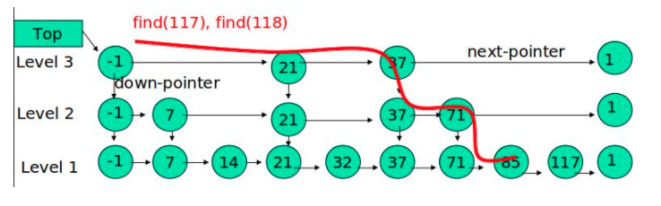

# 二、Redis数据结构

Redis支持多种类型的数据结构，如:

* 二进制安全的字符串
* Lists: 按插入顺序排序的字符串元素的集合。他们基本上就是_链表（linked lists）_。
* Sets: 不重复且无序的字符串元素的集合。
* Sorted sets,类似Sets,但是每个字符串元素都关联到一个叫_score_浮动数值（floating number value）。里面的元素总是通过score进行着排序，所以不同的是，它是可以检索的一系列元素。（例如你可能会问：给我前面10个或者后面10个元素）。
* Hashes,由field和关联的value组成的map。field和value都是字符串的。这和Ruby、Python的hashes很像。
* Bit arrays (或者说 simply bitmaps): 通过特殊的命令，你可以将 String 值当作一系列 bits 处理：可以设置和清除单独的 bits，数出所有设为 1 的 bits 的数量，找到最前的被设为 1 或 0 的 bit，等等。
* HyperLogLogs: 这是被用于估计一个 set 中元素数量的概率性的数据结构。

Redis的数据结构如下图所示：


#### 2.1 Redis keys

Redis key值是二进制安全的，这意味着可以用任何二进制序列作为key值，从形如”foo”的简单字符串到一个JPEG文件的内容都可以。空字符串也是有效key值。

关于key的几条规则：

* 不建议太长的健值，因为不仅消耗内存，而且在数据中查找这类键值的计算成本很高。
* 保证可读性，如果你要用”u:1000:pwd”来代替”user:1000:password”，这没有什么问题，但后者更易阅读，并且由此增加的空间消耗相对于key object和value object本身来说很小。
* 最好坚持一种模式。例如使用":"或"."分隔

支持的命令：

| Redis命令                                                                   | RedisTemplate                                                                                                             |                 说明                |
| ------------------------------------------------------------------------- | ------------------------------------------------------------------------------------------------------------------------- | :-------------------------------: |
| `KEYS *、KEYS *key*、KEYS *key、KEYS key*`                                   | `redisTemplate.keys(key);`                                                                                                |     获取所有key，模糊查询_key_（支持通配符\*）    |
| <p><code>EXPIRE key 10</code><br><code>EXPIREAT key 1293840000</code></p> | <p><code>redisTemplate.expire(key, time, TimeUnit.SECONDS);</code><br><code>redisTemplate.expireAt(key, date);</code></p> | <p>指定key缓存失效时间<br>指定key缓存到期时间</p> |
| `TTL key`                                                                 | `redisTemplate.getExpire(key, TimeUnit.SECONDS);`                                                                         |            根据key获取过期时间            |
| <p><code>EXISTS key</code><br><code>EXISTS key1 key2 key3</code></p>      | <p><code>redisTemplate.hasKey(key);</code><br><code>redisTemplate.countExistingKeys(Arrays.asList(key));</code></p>       |   <p>判断key是否存在<br>检查key存在的数量</p>  |
| <p><code>DEL key</code><br><code>DEL key1 key2 key3</code></p>            | <p><code>redisTemplate.delete(key);</code><br><code>redisTemplate.delete(Arrays.asList(keys));</code></p>                 |    <p>删除指定key缓存<br>批量删除key</p>    |

#### 2.2 Redis Strings <a href="#redis-strings" id="redis-strings"></a>

这是最简单Redis类型。如果你只用这种类型，Redis就像一个可以持久化的memcached服务器（注：memcache的数据仅保存在内存中，服务器重启后，数据将丢失）。它是一个二进制安全的字符串，意味着它不仅能够存储字符串、还能存储图片、视频等多种类型, 最大长度支持512M。

支持的命令：

| Redis命令                                                              | RedisTemplate                                                                                                                    | 说明                                             |
| -------------------------------------------------------------------- | -------------------------------------------------------------------------------------------------------------------------------- | ---------------------------------------------- |
| <p><code>SET key value</code><br><code>SET key value time</code></p> | <p><code>redisTemplate.opsForValue().set(key,value);</code><br><code>redisTemplate.opsForValue().set(key,value,time);</code></p> | <p>设置普通缓存<br>设置普通缓存过期时间</p>                    |
| `GET key`                                                            | `redisTemplate.opsForValue().get(key);`                                                                                          | 获取普通缓存                                         |
| `INCE key`                                                           | `redisTemplate.opsForValue().increment(key, delta);`                                                                             | 递增                                             |
| `DECR key`                                                           | `redisTemplate.opsForValue().increment(key, -delta);`                                                                            | 递减                                             |
| `SETNX key value`                                                    | `redisTemplate.opsForValue().setIfAbsent(key,value);`                                                                            | 将 key 的值设为 value ，当且仅当 key 不存在                 |
| `SETEX key value`                                                    | `redisTemplate.opsForValue().setIfPresent(key,value);`                                                                           | 判断当前的键的值是否为v，是的话不作操作，不实的话进行替换。如果没有这个键也不会做任何操作。 |
| `GETSET key value`                                                   | `redisTemplate.opsForValue().getAndSet(key, value);`                                                                             | key存在设置新值，并返回旧值                                |

****

基于C语言中传统字符串的缺陷**(**因为 `char*` 类型的功能单一， 抽象层次低， 并且不能高效地支持一些 Redis 常用的操作，比如追加操作和长度计算操作**)**，Redis自己构建了一种名为简单动态字符串的抽象类型，简称SDS，其结构如下：

```c
typedef char *sds;


struct sdshdr {

    // buf 已占用长度
    int len;

    // buf 剩余可用长度
    int free;

    // 实际保存字符串数据的地方
    char buf[];
};
```

其中，类型 `sds` 是 `char *` 的别名（alias），而结构 `sdshdr` 则保存了 `len` 、 `free` 和 `buf` 三个属性。通过 `len` 属性， `sdshdr` 可以实现复杂度为 O(1) 的长度计算操作。另一方面， 通过对 `buf` 分配一些额外的空间， 并使用 `free` 记录未使用空间的大小， `sdshdr` 可以让执行追加操作所需的内存重分配次数大大减少。


#### 2.3 Redis Lists

Redis lists基于Linked Lists实现，这意味着即使在一个list中有数百万个元素，在头部或尾部添加一个元素的操作，其时间复杂度也是常数级别的。用LPUSH 命令在十个元素的list头部添加新元素，和在千万元素list头部添加新元素的速度相同。

| Redis命令                | RedisTemplate                                           | 说明               |
| ---------------------- | ------------------------------------------------------- | ---------------- |
| `RPUSH key value`\`    | `redisTemplate.opsForList().rightPush(key, value);`     | 将list放入缓存,从右边添加  |
| `LPUSH key value`      | `redisTemplate.opsForList().leftPush(key, value);`      | 将list放入缓存,从左边添加  |
| `LRANGE key 0 -1`      | `redisTemplate.opsForList().range(key, start, end);`    | 获取list缓存的内容      |
| `LLEN key`             | `redisTemplate.opsForList().size(key);`                 | 获取list缓存的长度      |
| `LINDEX key index`     | `redisTemplate.opsForList().index(key, index);`         | 通过索引 获取list中的值   |
| `LSET key index value` | `redisTemplate.opsForList().set(key, index, value);`    | 根据索引修改list中的某条数据 |
| `LREM key count value` | `redisTemplate.opsForList().remove(key, count, value);` | 移除N个值为value      |


基于Redis Lists可以实现消息队列，将需要延后处理的任务结构体序列化成字符串塞进 Redis 的列表，另一个线程从这个列表中轮询数据进行处理。


通过 LPUSH，RPOP 这样的方式，会存在一个性能风险点，就是消费者如果想要及时的处理数据，就要在程序中写个类似 while(true) 这样的逻辑，不停的去调用 RPOP 或 LPOP 命令，这就会给消费者程序带来些不必要的性能损失。

所以，Redis 还提供了 BLPOP、BRPOP 这种阻塞式读取的命令(带 B-Bloking的都是阻塞式)，客户端在没有读到队列数据时，自动阻塞，直到有新的数据写入队列，再开始读取新数据。这种方式就节省了不必要的 CPU 开销。


#### 2.4 Redis Sets

Set类型是一种无顺序集合, 它和List类型最大的区别是：集合中的元素没有顺序, 且元素是唯一的，Set类型的底层是通过哈希表实现的。

| Redis命令                   | RedisTemplate                                                  | 说明                    |
| ------------------------- | -------------------------------------------------------------- | --------------------- |
| `SMEMBEredisTemplate key` | `redisTemplate.opsForedisTemplateet().memberedisTemplate(key)` | 根据key获取Set中的所有值       |
| `SISMEMBER key value`     | `redisTemplate.opsForedisTemplateet().isMember(key, value);`   | 根据value从一个set中查询,是否存在 |
| `SADD key value1 value2`  | `redisTemplate.opsForedisTemplateet().add(key, values);`       | 将数据放入set缓存            |
| `SCARD key`               | `redisTemplate.opsForedisTemplateet().size(key);`              | 获取set缓存的长度            |
| `SREM key value1 value2`  | `redisTemplate.opsForedisTemplateet().remove(key, values);`    | 移除值为value的            |


#### 2.5 Redis Hashes

该类型是由field和关联的value组成的map。其中，field和value都是字符串类型的。

| Redis命令                             | RedisTemplate                                           | 说明                             |
| ----------------------------------- | ------------------------------------------------------- | ------------------------------ |
| `HMSET key key1 value1 key2 value2` | `redisTemplate.opsForHash().putAll(key, map);`          | 设置缓存                           |
| `HSET key item value`               | `redisTemplate.opsForHash().put(key, item, value);`     | 向一张hash表中放入数据,如果不存在将创建         |
| `HGET key item`                     | `redisTemplate..opsForHash().get(key, item);`           | 获取缓存，字段值                       |
| `HMGET key`                         | `redisTemplate.opsForHash().entries(key);`              | 获取hashKey对应的所有键值               |
| `DELETE key item1 item2 item3`      | `redisTemplate.opsForHash().delete(key, item);`         | 将 key 的值设为 value ，当且仅当 key 不存在 |
| `HEXISTS key item`                  | `redisTemplate.opsForHash().hasKey(key, item);`         | 判断hash表中是否有该项的值                |
| `HINCRBY key item by`               | `redisTemplate.opsForHash().increment(key, item, by);`  | hash递增 如果不存在,就会创建一个 并把新增后的值返回  |
| `HDEL key item by`                  | `redisTemplate.opsForHash().increment(key, item, -by);` | hash递减                         |


#### 2.6 Redis Sorted sets

ZSet是一种有序集合类型，每个元素都会关联一个double类型的分数权值，通过这个权值来为集合中的成员进行从小到大的排序。sorted set与set结构一样均不允许重复的元素，但与set不同的是sorted set除了member(元素)之外，每个member都会关联一个分数score。sorted set根据score对元素进行升序排列，如果有多个元素的分数相同，那么按照member的字典序升序排列，sorted set中元素不允许相同，但score允许相同。

适用场景：

* 排行榜，以用户id为member，充值总金额或得分作为score，那么就可以得到排行榜，但是需要注意的是sorted set是升序排列的，所以如果想要取前10的话，需要从最后一个元素开始。&#x20;
* 消息延迟发送，将消息体作为member，发送时间戳以score的形式存储，通过定时任务扫描sorted set，对score小于等于当前时间的score对应的消息体进行发送。&#x20;

sorted set有两种实现方式，一种是ziplist压缩表，一种是zset(dict、skiplist)，redis.conf有两个配置来控制，当sorted set中的元素个数小于128时(即元素对member score的个数，共256个元素)，使用ziplist，当元素对中member长度超过64个字节时使用zset。

| zset-max-ziplist-entries | 128 |
| ------------------------ | --- |
| zset-max-ziplist-value   | 64  |


（1）ziplist

Redis是基于内存的nosql，有些场景下为了节省内存redis会用“时间”换“空间”，ziplist就是很典型的例子。ziplist是由_**一系列特殊编码的连续内存块组成的顺序存储结构**_，类似于数组，ziplist在内存中是连续存储的，但是不同于数组，为了节省内存 ziplist的每个元素所占的内存大小可以不同（数组中叫元素，ziplist叫节点**entry**，下文都用“节点”），每个节点可以用来存储一个整数或者一个字符串。\
下图是ziplist在内存中的布局：


* zlbytes: ziplist的长度（单位: 字节)，是一个32位无符号整数
* zltail: ziplist最后一个节点的偏移量，反向遍历ziplist或者pop尾部节点的时候有用。
* zllen: ziplist的节点（entry）个数
* entry: 节点
* zlend: 值为0xFF，用于标记ziplist的结尾


（2）skiplist

跳表是一种随机化的数据结构，目前开源软件 Redis 和 LevelDB 都有用到它，它的效率和红黑树以及 AVL 树不相上下，但跳表的原理相当简单，只要你能熟练操作链表，就能轻松实现一个 SkipList。

跳表本质上是对链表的一种优化，通过逐层跳步采样的方式构建索引，以加快查找速度。如果只用普通链表，只能一个一个往后找。跳表就不一样了，可以高层索引，一次跳跃多个节点，如果找过头了，就用更下层的索引。



使用概率均衡的思路，确定新插入节点的层数。Redis使用随机函数决定层数。直观上来说，默认1层，和丢硬币一样，如果是正面就继续往上，这样持续迭代，最大层数32层。可以看到，50%的概率被分配到第一层，25%的概率被分配到第二层，12.5%的概率被分配到第三层。这种方式保证了越上层数量越少，自然跨越起来越方便。


#### 2.7 3种特殊类型

（1）HyperLogLogs（基数统计）

* **什么是基数？**

举个例子，A = {1, 2, 3, 4, 5}， B = {3, 5, 6, 7, 9}；那么基数（不重复的元素）= 1, 2, 4, 6, 7, 9； （允许容错，即可以接受一定误差）

* **HyperLogLogs 基数统计用来解决什么问题**？

这个结构可以非常省内存的去统计各种计数，比如注册 IP 数、每日访问 IP 数、页面实时UV、在线用户数，共同好友数等。

* **它的优势体现在哪**？

一个大型的网站，每天 IP 比如有 100 万，粗算一个 IP 消耗 15 字节，那么 100 万个 IP 就是 15M。而 HyperLogLog 在 Redis 中每个键占用的内容都是 12K，理论存储近似接近 2^64 个值，不管存储的内容是什么，它一个基于基数估算的算法，只能比较准确的估算出基数，可以使用少量固定的内存去存储并识别集合中的唯一元素。而且这个估算的基数并不一定准确，是一个带有 0.81% 标准错误的近似值（对于可以接受一定容错的业务场景，比如IP数统计，UV等，是可以忽略不计的）。

* **相关命令使用**

```shell
127.0.0.1:6379> pfadd key1 a b c d e f g h i	# 创建第一组元素
(integer) 1
127.0.0.1:6379> pfcount key1					# 统计元素的基数数量
(integer) 9
127.0.0.1:6379> pfadd key2 c j k l m e g a		# 创建第二组元素
(integer) 1
127.0.0.1:6379> pfcount key2
(integer) 8
127.0.0.1:6379> pfmerge key3 key1 key2			# 合并两组：key1 key2 -> key3 并集
OK
127.0.0.1:6379> pfcount key3
(integer) 13
  
```


（2）Bitmap （位存储）

> Bitmap 即位图数据结构，都是操作二进制位来进行记录，只有0 和 1 两个状态。

* **用来解决什么问题**？

比如：统计用户信息，活跃，不活跃！ 登录，未登录！ 打卡，不打卡！ **两个状态的，都可以使用 Bitmaps**！

如果存储一年的打卡状态需要多少内存呢？ 365 天 = 365 bit 1字节 = 8bit 46 个字节左右！

* **相关命令使用**

使用bitmap 来记录 周一到周日的打卡！ 周一：1 周二：0 周三：0 周四：1 ......

```
127.0.0.1:6379> setbit sign 0 1
(integer) 0
127.0.0.1:6379> setbit sign 1 1
(integer) 0
127.0.0.1:6379> setbit sign 2 0
(integer) 0
127.0.0.1:6379> setbit sign 3 1
(integer) 0
127.0.0.1:6379> setbit sign 4 0
(integer) 0
127.0.0.1:6379> setbit sign 5 0
(integer) 0
127.0.0.1:6379> setbit sign 6 1
(integer) 0

```

查看某一天是否有打卡！

```
127.0.0.1:6379> getbit sign 3
(integer) 1
127.0.0.1:6379> getbit sign 5
(integer) 0
```

统计操作，统计 打卡的天数！

```
127.0.0.1:6379> bitcount sign # 统计这周的打卡记录，就可以看到是否有全勤！
(integer) 3
    
```


（3）geospatial (地理位置)

> Redis 的 Geo 在 Redis 3.2 版本就推出了! 这个功能可以推算地理位置的信息: 两地之间的距离, 方圆几里的人

* **geoadd**

> 添加地理位置

```
127.0.0.1:6379> geoadd china:city 118.76 32.04 manjing 112.55 37.86 taiyuan 123.43 41.80 shenyang
(integer) 3
127.0.0.1:6379> geoadd china:city 144.05 22.52 shengzhen 120.16 30.24 hangzhou 108.96 34.26 xian
(integer) 3  
```

* **规则**

两级无法直接添加，我们一般会下载城市数据(这个网址可以查询 GEO： http://www.jsons.cn/lngcode)！

* 有效的经度从-180度到180度。
* 有效的纬度从-85.05112878度到85.05112878度。

```
# 当坐标位置超出上述指定范围时，该命令将会返回一个错误。
127.0.0.1:6379> geoadd china:city 39.90 116.40 beijin
(error) ERR invalid longitude,latitude pair 39.900000,116.400000
```

####
