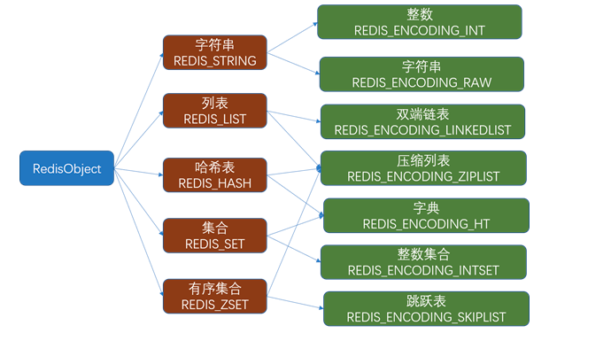

# Redis

### 一、Redis基础概念

Redis（Remote Dictionary Server ，远程字典服务)是现在最受欢迎的NoSQL数据库之一，Redis是一个使用ANSI C编写的开源、包含多种数据结构、支持网络、基于内存、可选持久性的键值对存储数据库，具有丰富的应用场景，例如：缓存系统（“热点”数据：高频读、低频写）、计数器、消息队列系统、排行榜、社交网络和实时系统。其具备如下特性：

* 基于内存运行，性能高效
* 支持分布式，理论上可以无限扩展
* key-value存储系统
* 开源的使用ANSI C语言编写、遵守BSD协议、支持网络、可基于内存亦可持久化的日志型、Key-Value数据库，并提供多种语言的AP

相比于其他数据库类型，Redis具备的特点是：

* C/S通讯模型
* 单进程单线程模型
* 丰富的数据类型
* 操作具有原子性
* 持久化
* 高并发读写
* 支持lua脚本

#### Mac环境Redis安装

* 搜索Redis安装包

```shell
(base) B000000348954H:~ liwantao$ brew search redis
==> Formulae
hiredis                   redis ✔                   redis-leveldb             redis@3.2                 redis@4.0 ✔
==> Casks
another-redis-desktop-manager               redis                                       redisinsight

```

* 安装 Redis 4.0 版本

```
brew install redis@4.0
```

* 配置 Redis configure文件：/usr/local/etc 下修改redis.config找到

> daemonize no改成yes 以守护进程的方式启动

* 配置环境变量

```
vim ~/.bash_profile
```

&#x20;     添加如下内容：

```
export PATH="/usr/local/opt/redis@4.0/bin:$PATH"
```

* 启动 Redis Server

```
brew services start redis@4.0
```

&#x20;   或者

```
redis-server /usr/local/etc/redis.conf
```

* 连接 Redis 客户端（Client）：`redis-cli -h host -p port`

```
redis-cli -h 127.0.0.1 -p 6379
```

* 关闭 Redis 客户端

```
redis-cli shutdown
```


### 二、Redis数据结构

Redis支持多种类型的数据结构，如:

* 二进制安全的字符串
* Lists: 按插入顺序排序的字符串元素的集合。他们基本上就是_链表（linked lists）_。
* Sets: 不重复且无序的字符串元素的集合。
* Sorted sets,类似Sets,但是每个字符串元素都关联到一个叫_score_浮动数值（floating number value）。里面的元素总是通过score进行着排序，所以不同的是，它是可以检索的一系列元素。（例如你可能会问：给我前面10个或者后面10个元素）。
* Hashes,由field和关联的value组成的map。field和value都是字符串的。这和Ruby、Python的hashes很像。
* Bit arrays (或者说 simply bitmaps): 通过特殊的命令，你可以将 String 值当作一系列 bits 处理：可以设置和清除单独的 bits，数出所有设为 1 的 bits 的数量，找到最前的被设为 1 或 0 的 bit，等等。
* HyperLogLogs: 这是被用于估计一个 set 中元素数量的概率性的数据结构。

Redis的数据结构如下图所示：



#### 2.1 Redis keys

Redis key值是二进制安全的，这意味着可以用任何二进制序列作为key值，从形如”foo”的简单字符串到一个JPEG文件的内容都可以。空字符串也是有效key值。

关于key的几条规则：

* 不建议太长的健值，因为不仅消耗内存，而且在数据中查找这类键值的计算成本很高。
* 保证可读性，如果你要用”u:1000:pwd”来代替”user:1000:password”，这没有什么问题，但后者更易阅读，并且由此增加的空间消耗相对于key object和value object本身来说很小。
* 最好坚持一种模式。例如使用":"或"."分隔

支持的命令：

| Redis命令                                                                   | RedisTemplate                                                                                                             |                 说明                |
| ------------------------------------------------------------------------- | ------------------------------------------------------------------------------------------------------------------------- | :-------------------------------: |
| `KEYS *、KEYS *key*、KEYS *key、KEYS key*`                                   | `redisTemplate.keys(key);`                                                                                                |     获取所有key，模糊查询_key_（支持通配符\*）    |
| <p><code>EXPIRE key 10</code><br><code>EXPIREAT key 1293840000</code></p> | <p><code>redisTemplate.expire(key, time, TimeUnit.SECONDS);</code><br><code>redisTemplate.expireAt(key, date);</code></p> | <p>指定key缓存失效时间<br>指定key缓存到期时间</p> |
| `TTL key`                                                                 | `redisTemplate.getExpire(key, TimeUnit.SECONDS);`                                                                         |            根据key获取过期时间            |
| <p><code>EXISTS key</code><br><code>EXISTS key1 key2 key3</code></p>      | <p><code>redisTemplate.hasKey(key);</code><br><code>redisTemplate.countExistingKeys(Arrays.asList(key));</code></p>       |   <p>判断key是否存在<br>检查key存在的数量</p>  |
| <p><code>DEL key</code><br><code>DEL key1 key2 key3</code></p>            | <p><code>redisTemplate.delete(key);</code><br><code>redisTemplate.delete(Arrays.asList(keys));</code></p>                 |    <p>删除指定key缓存<br>批量删除key</p>    |

#### 2.2 Redis Strings <a href="#redis-strings" id="redis-strings"></a>

这是最简单Redis类型。如果你只用这种类型，Redis就像一个可以持久化的memcached服务器（注：memcache的数据仅保存在内存中，服务器重启后，数据将丢失）。它是一个二进制安全的字符串，意味着它不仅能够存储字符串、还能存储图片、视频等多种类型, 最大长度支持512M。

支持的命令：

| Redis命令                                                              | RedisTemplate                                                                                                                    | 说明                                             |
| -------------------------------------------------------------------- | -------------------------------------------------------------------------------------------------------------------------------- | ---------------------------------------------- |
| <p><code>SET key value</code><br><code>SET key value time</code></p> | <p><code>redisTemplate.opsForValue().set(key,value);</code><br><code>redisTemplate.opsForValue().set(key,value,time);</code></p> | <p>设置普通缓存<br>设置普通缓存过期时间</p>                    |
| `GET key`                                                            | `redisTemplate.opsForValue().get(key);`                                                                                          | 获取普通缓存                                         |
| `INCE key`                                                           | `redisTemplate.opsForValue().increment(key, delta);`                                                                             | 递增                                             |
| `DECR key`                                                           | `redisTemplate.opsForValue().increment(key, -delta);`                                                                            | 递减                                             |
| `SETNX key value`                                                    | `redisTemplate.opsForValue().setIfAbsent(key,value);`                                                                            | 将 key 的值设为 value ，当且仅当 key 不存在                 |
| `SETEX key value`                                                    | `redisTemplate.opsForValue().setIfPresent(key,value);`                                                                           | 判断当前的键的值是否为v，是的话不作操作，不实的话进行替换。如果没有这个键也不会做任何操作。 |
| `GETSET key value`                                                   | `redisTemplate.opsForValue().getAndSet(key, value);`                                                                             | key存在设置新值，并返回旧值                                |

****

基于C语言中传统字符串的缺陷**(**因为 `char*` 类型的功能单一， 抽象层次低， 并且不能高效地支持一些 Redis 常用的操作，比如追加操作和长度计算操作**)**，Redis自己构建了一种名为简单动态字符串的抽象类型，简称SDS，其结构如下：

```c
typedef char *sds;


struct sdshdr {

    // buf 已占用长度
    int len;

    // buf 剩余可用长度
    int free;

    // 实际保存字符串数据的地方
    char buf[];
};
```

其中，类型 `sds` 是 `char *` 的别名（alias），而结构 `sdshdr` 则保存了 `len` 、 `free` 和 `buf` 三个属性。通过 `len` 属性， `sdshdr` 可以实现复杂度为 O(1) 的长度计算操作。另一方面， 通过对 `buf` 分配一些额外的空间， 并使用 `free` 记录未使用空间的大小， `sdshdr` 可以让执行追加操作所需的内存重分配次数大大减少。

****

****

****

#### 三、Redis高可用

持久化

主从

哨兵

#### 四、Redis性能优化

reactor模型

多线程

#### 五、Redis应用场景

缓存

分布式锁


#### 附录

* [Redis下载与安装](https://www.cnblogs.com/liyihua/p/14482412.html?ivk\_sa=1024320u)
* [阿里云Redis开发规范](https://developer.aliyun.com/article/531067)
*
