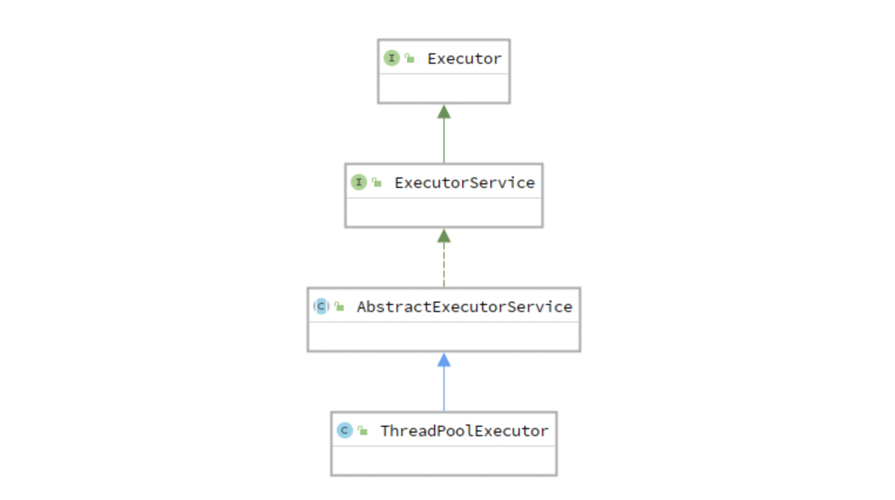

# Java线程池学习笔记

**引言**

**一切要从 CPU 说起**

你可能会有疑问，讲多线程为什么要从 CPU 说起呢？原因很简单，**在这里没有那些时髦的概念，你可以更加清晰地看清问题的本质**。

CPU 并不知道线程、进程之类的概念。CPU 只知道两件事：

1. 从内存中取出指令；
2. 执行指令，然后回到 1。

接下来的问题就是 CPU 从哪里取出指令呢？答案是来自一个被称为 Program Counter（简称 PC）的寄存器，也就是我们熟知的程序计数器，在这里大家不要把寄存器想得太神秘，你可以简单地把寄存器理解为内存，只不过存取速度更快而已。


那么是谁来设置 PC 寄存器中的指令地址呢？原来 PC 寄存器中的地址默认是自动加 1 的，这当然是有道理的，因为大部分情况下 CPU 都是一条接一条顺序执行，当遇到 if、else 时，这种顺序执行就被打破了，CPU 在执行这类指令时会根据计算结果来动态改变 PC 寄存器中的值，这样 CPU 就可以正确地跳转到需要执行的指令了。

聪明的你一定会问，那么 PC 中的初始值是怎么被设置的呢？在回答这个问题之前我们需要知道 CPU 执行的指令来自哪里？是来自内存，废话，内存中的指令是从磁盘中保存的可执行程序加载过来的，磁盘中可执行程序是编译器生成的，编译器又是从哪里生成的机器指令呢？答案就是**我们定义的函数**。


我们想让 CPU 执行某个函数，那么只需要把函数对应的第一条机器执行装入 PC 寄存器就可以了，**这样即使没有操作系统我们也可以让 CPU 执行程序**，虽然可行但这是一个非常繁琐的过程，我们需要：

* 在内存中找到一块大小合适的区域装入程序；
* 找到函数入口，设置好 PC 寄存器让 CPU 开始执行程序。

这两个步骤绝不是那么容易的事情，如果每次在执行程序时程序员自己手动实现上述两个过程会疯掉的，因此聪明的程序员就会想干脆直接写个程序来自动完成上面两个步骤吧。

机器指令需要加载到内存中执行，因此需要记录下内存的起始地址和长度；同时要找到函数的入口地址并写到 PC 寄存器中，想一想这是不是需要一个数据结构来记录下这些信息：

```cpp
struct *** {  
   void* start_addr;  
   int len;      
   void* start_point;   ...
};
```

接下来就是起名字时刻。这个数据结构总要有个名字吧，这个结构体用来记录什么信息呢？记录的是程序在被加载到内存中的运行状态，程序从磁盘加载到内存跑起来叫什么好呢？干脆就叫**进程（Process**）好了，我们的指导原则就是一定要听上去比较神秘，总之大家都不容易弄懂就对了，我将其称为“**弄不懂原则**”。就这样进程诞生了。CPU 执行的第一个函数也起个名字，第一个要被执行的函数听起来比较重要，干脆就叫 **main 函数**吧。

完成上述两个步骤的程序也要起个名字，根据“弄不懂原则”，这个“简单”的程序就叫**操作系统**（Operating System）好啦。就这样操作系统诞生了，程序员要想运行程序再也不用自己手动加载一遍了。现在进程和操作系统都有了，一切看上去都很完美。

**从单核到多核，如何充分利用多核**

人类的一大特点就是生命不息折腾不止，从单核折腾到了多核。这时，假设我们想写一个程序并且要充分利用多核该怎么办呢？有的同学可能会说不是有进程吗，多开几个进程不就可以了？听上去似乎很有道理，但是主要存在这样几个问题：

* 进程是需要占用内存空间的（从上一节能看到这一点），如果多个进程基于同一个可执行程序，那么这些进程其内存区域中的内容几乎完全相同，这显然会造成内存的浪费。
* 计算机处理的任务可能是比较复杂的，这就涉及到了进程间通信，由于各个进程处于不同的内存地址空间，进程间通信天然需要借助操作系统，这就在增大编程难度的同时也增加了系统开销。

**从进程到线程**

进程的缺点在于只有一个入口函数，也就是 main 函数，因此进程中的机器指令**只能被一个 CPU 执行**，那么有没有办法让多个 CPU 来执行同一个进程中的机器指令呢？聪明的你应该能想到，既然我们可以把 main 函数的第一条指令地址写入 PC 寄存器，那么其它函数和 main 函数又有什么区别呢？答案是没什么区别，main 函数的特殊之处无非就在于是 CPU 执行的第一个函数，除此之外再无特别之处，**我们可以把 PC 寄存器指向 main 函数，就可以把 PC 寄存器指向任何一个函数**。**当我们把 PC 寄存器指向非 main 函数时，线程就诞生了**。


**一、线程池**

在并发环境下，系统不能够确定在任意时刻中，有多少任务需要执行，有多少资源需要投入。这种**不确定性**将带来以下若干问题：

* 频繁申请/销毁资源和调度资源，将带来额外的消耗，可能会非常巨大。
* 对资源无限申请缺少抑制手段，易引发系统资源耗尽的风险。
* 系统无法合理管理内部的资源分布，会降低系统的稳定性。

为解决资源分配这个问题，线程池采用了“池化”（Pooling）思想，将资源统一在一起管理。除去线程池，还有其他比较典型的使用池化思想的策略：

* 内存池\(Memory Pooling\)：预先申请内存，提升申请内存速度，减少内存碎片。
* 连接池\(Connection Pooling\)：预先申请数据库连接，提升申请连接的速度，降低系统的开销。
* 实例池\(Object Pooling\)：循环使用对象，减少资源在初始化和释放时的昂贵损耗。

**二、Java中的线程池**

**1. 总体设计**



Java中的线程池核心实现类是**ThreadPoolExecutor**，ThreadPoolExecutor实现的顶层接口是Executor，顶层接口Executor提供了一种思想：将任务提交和任务执行进行解耦。用户无需关注如何创建线程，如何调度线程来执行任务，用户只需提供Runnable对象，将任务的运行逻辑提交到执行器\(Executor\)中，由Executor框架完成线程的调配和任务的执行部分。

```java
public interface Executor {
    void execute(Runnable command);
}
```

ExecutorService接口增加了一些能力：（1）扩充执行任务的能力，补充可以为一个或一批异步任务生成Future的方法；（2）提供了管控线程池的方法，比如停止线程池的运行。AbstractExecutorService则是上层的抽象类，将执行任务的流程串联了起来，保证下层的实现只需关注一个执行任务的方法即可。

```java
public interface ExecutorService extends Executor {

    void shutdown();

    List<Runnable> shutdownNow();

    boolean isShutdown();

    boolean isTerminated();

    boolean awaitTermination(long timeout, TimeUnit unit)
        throws InterruptedException;

    <T> Future<T> submit(Callable<T> task);

    <T> Future<T> submit(Runnable task, T result);

    Future<?> submit(Runnable task);

    <T> List<Future<T>> invokeAll(Collection<? extends Callable<T>> tasks)
        throws InterruptedException;

    <T> List<Future<T>> invokeAll(Collection<? extends Callable<T>> tasks,
                                  long timeout, TimeUnit unit)
        throws InterruptedException;

    <T> T invokeAny(Collection<? extends Callable<T>> tasks)
        throws InterruptedException, ExecutionException;


    <T> T invokeAny(Collection<? extends Callable<T>> tasks,
                    long timeout, TimeUnit unit)
        throws InterruptedException, ExecutionException, TimeoutException;
}
```

最下层的实现类ThreadPoolExecutor实现最复杂的运行部分，ThreadPoolExecutor将会一方面维护自身的生命周期，另一方面同时管理线程和任务，使两者良好的结合从而执行并行任务。

线程池在内部实际上构建了一个生产者消费者模型，将**线程**和**任务**两者解耦，并不直接关联，从而良好的缓冲任务，复用线程。线程池的运行主要分成两部分：**任务管理**、**线程管理**。任务管理部分充当生产者的角色，当任务提交后，线程池会判断该任务后续的流转：

（1）直接申请线程执行该任务；

（2）缓冲到队列中等待线程执行；

（3）拒绝该任务。

线程管理部分是消费者，它们被统一维护在线程池内，根据任务请求进行线程的分配，当线程执行完任务后则会继续获取新的任务去执行，最终当线程获取不到任务的时候，线程就会被回收。


**2. 线程池生命周期**

线程池运行的状态，并不是用户显式设置的，而是伴随着线程池的运行，由内部来维护。线程池内部使用一个变量维护两个值：运行状态\(runState\)和线程数量 \(workerCount\)。在具体实现中，线程池将运行状态\(runState\)、线程数量 \(workerCount\)两个关键参数的维护放在了一起，如下代码所示：

```java
    private final AtomicInteger ctl = new AtomicInteger(ctlOf(RUNNING, 0));

    private static final int COUNT_BITS = Integer.SIZE - 3;
    // 000-11111111111111111111111111111
    private static final int CAPACITY   = (1 << COUNT_BITS) - 1;

    // runState is stored in the high-order bits
    // 111-00000000000000000000000000000
    private static final int RUNNING    = -1 << COUNT_BITS;
      // 000-00000000000000000000000000000
    private static final int SHUTDOWN   =  0 << COUNT_BITS;
      // 001-00000000000000000000000000000
    private static final int STOP       =  1 << COUNT_BITS;
      // 010-00000000000000000000000000000
    private static final int TIDYING    =  2 << COUNT_BITS;
      // 011-00000000000000000000000000000
    private static final int TERMINATED =  3 << COUNT_BITS;

    // Packing and unpacking ctl
    private static int runStateOf(int c)     { return c & ~CAPACITY; }
    private static int workerCountOf(int c)  { return c & CAPACITY; }
    private static int ctlOf(int rs, int wc) { return rs | wc; }
```

`ctl`这个AtomicInteger类型，是对线程池的运行状态和线程池中有效线程的数量进行控制的一个字段， 它同时包含两部分的信息：线程池的运行状态 \(runState\) 和线程池内有效线程的数量 \(workerCount\)，高3位保存runState，低29位保存workerCount，两个变量之间互不干扰。用一个变量去存储两个值，可避免在做相关决策时，出现不一致的情况，不必为了维护两者的一致，而占用锁资源。通过阅读线程池源代码也可以发现，经常出现要同时判断线程池运行状态和线程数量的情况。线程池也提供了若干方法去供用户获得线程池当前的运行状态、线程个数。这里都使用的是位运算的方式，相比于基本运算，速度也会快。

ThreadPoolExecutor的运行状态有5种，分别为：

| 运行状态 | 状态描述 |
| :--- | :--- |
| RUNNING | 能接受新提交的任务，并且也能处理阻塞队列中的任务。 |
| SHUTDOWN | 关闭状态，不再接受新提交的任务，但却可以继续处理阻塞队列中已保存的任务 |
| STOP | 不能接受新任务，也不能处理阻塞队列中的任务，会中断正在处理任务的线程 |
| TIDYING | 所有的任务都已终止，workCount\(有效线程数\)为0 |
| TERMINATE | 在terminated\(\)方法执行完后进入该状态，线程池彻底终止 |


**3. 任务管理**

**3.1 任务调度**

首先，所有任务的调度都是由execute方法完成的，这部分完成的工作是：检查现在线程池的运行状态、运行线程数、运行策略，决定接下来执行的流程，是直接申请线程执行，或是缓冲到队列中执行，亦或是直接拒绝该任务。其执行过程如下：

* 首先检测线程池运行状态，如果不是RUNNING，则直接拒绝，线程池要保证在RUNNING的状态下才能接受新的任务。
* 如果workerCount &lt; corePoolSize，则创建并启动一个线程来执行新提交的任务。
* 如果workerCount &gt;= corePoolSize，且线程池内的阻塞队列未满，则将任务添加到该阻塞队列中。
* 如果workerCount &gt;= corePoolSize && workerCount &lt; maximumPoolSize，且线程池内的阻塞队列已满，则创建并启动一个线程来执行新提交的任务。
* 如果workerCount &gt;= maximumPoolSize，并且线程池内的阻塞队列已满, 则根据拒绝策略来处理该任务, 默认的处理方式是直接抛异常。

其执行流程如下图所示：


**3.2 任务缓冲**

线程池中是以生产者消费者模式，通过一个**阻塞队列**来实现的。阻塞队列缓存任务，工作线程从阻塞队列中获取任务。阻塞队列\(BlockingQueue\)是一个支持两个附加操作的队列。这两个附加的操作是：在队列为空时，获取元素的线程会等待队列变为非空。当队列满时，存储元素的线程会等待队列可用。阻塞队列常用于生产者和消费者的场景，生产者是往队列里添加元素的线程，消费者是从队列里拿元素的线程。

下图中展示了线程1往阻塞队列中添加元素，而线程2从阻塞队列中移除元素：


使用不同的队列可以实现不一样的任务存取策略。

| 队列名称 | 描述 |
| :---: | :--- |
| ArrayBlockingQueue | 一个用数组实现的有界阻塞队列，按照先进先出\(FIFO\)的原则对元素进行排序，支持公平锁和非公平锁 |
| LinkedBlockingQueue | 一个由链表组成的有界队列，按照先进先出\(FIFO\)的原则对元素进行排序，队列默认长度Integer.MAX\_VALUE,所以默认创建的该队列有容量危险 |
| PriorityBlockingQueue | 支持线程优先级排序的无界队列，默认按自然序排序，也可以自定义实现compareTo\(\)方法指定排序规则，不能保证同优先级元素的顺序 |
| DelayQueue | 实现延迟获取的队列，在创建元素时可以指定多久后才可以从队列中获取该元素 |
| SynchronousQueue | 一个不储存元素的阻塞队列（无锁），每一个put操作必须等待take操作，否则不能添加元素，Executors.newCachedThreasPool\(\)就使用了这个队列。 |
| LinkedTransferQueue | 有链表组成的无界阻塞队列\(SynchronousQueue+LinkedBlockingQueue\)，相比于其他队列多了transfer和tryTransfer方法 |
| LinkedBlockingDeque | 一个有链表组成的双端阻塞队列，队列头部和尾部都可以添加和移除元素，多线程并发时，可以将锁的竞争最多降低一半 |

**3.3 任务申请**

由上文的任务分配部分可知，任务的执行有两种可能：一种是任务直接由新创建的线程执行，另一种是线程从任务队列中获取任务然后执行，执行完任务的空闲线程会再次去从队列中申请任务再去执行。第一种情况**仅出现在线程初始创建**的时候，第二种是线程获取任务绝大多数的情况。

线程需要从任务缓存模块中不断地取任务执行，帮助线程从阻塞队列中获取任务，实现线程管理模块和任务管理模块之间的通信。这部分策略由getTask方法实现，其执行流程如下图所示：


getTask\(\)这部分进行了多次判断，为的是**控制线程的数量**，使其符合线程池的状态。如果线程池现在不应该持有那么多线程，则会返回null值。工作线程Worker会不断接收新任务去执行，而当工作线程Worker接收不到任务的时候，就会开始被**回收**。

**3.4 任务拒绝**

任务拒绝模块是线程池的保护部分，线程池有一个最大的容量，当线程池的任务缓存队列已满，并且线程池中的线程数目达到maximumPoolSize时，就需要拒绝掉该任务，采取任务拒绝策略，保护线程池。

拒绝策略是一个接口，其设计如下：

```java
public interface RejectedExecutionHandler {
    void rejectedExecution(Runnable r, ThreadPoolExecutor executor);
}
```

用户可以通过实现这个接口去定制拒绝策略，也可以选择JDK提供的四种已有拒绝策略，其特点如下：

| 策略名称 | 描述 |
| :--- | :--- |
| ThreadPoolExecutor.AbortPolicy | 丢弃任务并抛出RejectedExecutionException异常，这是线程池**默认**的拒绝策略 |
| ThreadPoolExecutor.DiscardPolicy | 丢弃任务但不抛出异常 |
| ThreadPoolExecutor.DiscardOldestPolicy | 丢弃队列最前面的任务，并重新提交被拒绝的任务 |
| ThreadPoolExecutor.CallerRunsPolicy | 由调用线程\(提交任务的线程\)执行该任务 |

**4. 线程管理**

**4.1 Worker线程**

线程池为了掌握线程的状态并维护线程的生命周期，设计了线程池内的工作线程Worker。它的部分代码：

```java
private final class Worker extends AbstractQueuedSynchronizer implements Runnable{
    final Thread thread;//Worker持有的线程
    Runnable firstTask;//初始化的任务，可以为null
}
```

Worker这个工作线程，实现了Runnable接口，并持有一个线程thread，一个初始化的任务firstTask。thread是在调用构造方法时通过ThreadFactory来创建的线程，可以用来执行任务；firstTask用它来保存传入的第一个任务，这个任务可以有也可以为null。如果这个值是非空的，那么线程就会在启动初期立即执行这个任务，也就对应核心线程创建时的情况；如果这个值是null，那么就需要创建一个线程去执行任务列表（workQueue）中的任务，也就是非核心线程的创建。

Worker执行任务的模型如下图所示：


线程池需要管理线程的生命周期，需要在线程长时间不运行的时候进行回收。线程池使用一张**Hash表**去持有线程的引用，这样可以通过添加引用、移除引用这样的操作来控制线程的生命周期。这个时候重要的就是**如何判断线程是否在运行**。

Worker是通过继承AQS，使用AQS来实现独占锁这个功能。没有使用可重入锁ReentrantLock，而是使用AQS，为的就是实现不可重入的特性去反映线程现在的执行状态。

* lock方法一旦获取了独占锁，表示当前线程正在执行任务中。 
* 如果正在执行任务，则不应该中断线程。
* 如果该线程现在不是独占锁的状态，也就是空闲的状态，说明它没有在处理任务，这时可以对该线程进行中断。 
* 线程池在执行shutdown方法或tryTerminate方法时会调用interruptIdleWorkers方法来中断空闲的线程，interruptIdleWorkers方法会使用**tryLock**方法来判断线程池中的线程是否是空闲状态；如果线程是空闲状态则可以安全回收。

```java
private void interruptIdleWorkers(boolean onlyOne) {
        final ReentrantLock mainLock = this.mainLock;
        mainLock.lock();
        try {
            for (Worker w : workers) {
                Thread t = w.thread;
                if (!t.isInterrupted() && w.tryLock()) {
                    try {
                        t.interrupt();
                    } catch (SecurityException ignore) {
                    } finally {
                        w.unlock();
                    }
                }
                if (onlyOne)
                    break;
            }
        } finally {
            mainLock.unlock();
        }
    }
```

在线程回收过程中就使用到了这种特性，回收过程如下图所示：


**4.2 Worker线程增加**

增加线程是通过线程池中的addWorker方法，该方法的功能就是增加一个线程，该方法不考虑线程池是在哪个阶段增加的该线程，这个分配线程的策略是在上个步骤完成的，该步骤仅仅完成增加线程，并使它运行，最后返回是否成功这个结果。addWorker方法有两个参数：firstTask、core。firstTask参数用于指定新增的线程执行的第一个任务，该参数可以为空；core参数为true表示在新增线程时会判断当前活动线程数是否少于corePoolSize，false表示新增线程前需要判断当前活动线程数是否少于maximumPoolSize，其执行流程如下图所示：


**4.3 Worker线程回收**

线程池中线程的销毁依赖**JVM自动的回收**，线程池做的工作是根据当前线程池的状态维护一定数量的线程引用，防止这部分线程被JVM回收，当线程池决定哪些线程需要回收时，只需要将其引用消除即可。Worker被创建出来后，就会不断地进行轮询，然后获取任务去执行，核心线程可以无限等待获取任务，非核心线程要限时获取任务。当Worker无法获取到任务，也就是获取的任务为空时，循环会结束，Worker会主动消除自身在线程池内的引用。

```java
try {
  while (task != null || (task = getTask()) != null) {
    //执行任务
  }
} finally {
  processWorkerExit(w, completedAbruptly);//获取不到任务时，主动回收自己
}
```

线程回收的工作是在processWorkerExit方法完成的。


事实上，在这个方法中，将线程引用移出线程池就已经结束了线程销毁的部分。但由于引起线程销毁的可能性有很多，线程池还要判断是什么引发了这次销毁，是否要改变线程池的现阶段状态，是否要根据新状态，重新分配线程。

**4.4 Worker线程执行任务**

在Worker类中的run方法调用了runWorker方法来执行任务，runWorker方法的执行过程如下：

1. while循环不断地通过getTask\(\)方法获取任务。
2. getTask\(\)方法从阻塞队列中取任务。 
3. 如果线程池正在停止，那么要保证当前线程是中断状态，否则要保证当前线程不是中断状态。 
4. 执行任务。
5. 如果getTask结果为null则跳出循环，执行processWorkerExit\(\)方法，销毁线程。

执行流程如下图所示：


**三、Spring中的线程池**

**1. TaskExecutor**

多线程并发处理起来通常比较麻烦，如果你使用spring容器来管理业务bean，事情就好办了多了。spring封装了java的多线程的实现，你只需要关注于并发事物的流程以及一些并发负载量等特性。Spring 中对与任务的执行提供了两种抽象， `TaskExecutor` 和 `TaskScheduler`，分别表示执行异步任务和定时任务。

Spring 中已经实现了多种类型的 TaskExecutor，在绝大多数情况下，不需要自己去实现。

* SyncTaskExecutor：用来执行非异步的任务，通常用于不需要多线程的场景，实际用的比较少，通常用来执行测试用例
* SimpleAsyncTaskExecutor：这个实现不会重用任何的线程，每当有新任务的时候，都是重新创建一个线程
* ConcurrentTaskExecutor：这个实现是对 Executor 的适配，可以配置 Executor 的全部参数，但是一般很少使用，除非需要完全自主配置线程池
* **ThreadPoolTaskExecutor**：这个实现最常用，其中封装了 ThreadPoolExecutor，如果还需要使用 Executor 的其他实现，可以使用 ConcurrentTaskExecutor
* WorkManagerTaskExecutor：这个用的就更少了，这个实现封装了 WebLogic 的 API，以便在 WebLogic 中间件上运行 Spring 程序
* DefaultManagedTaskExecutor：这个实现的目标是替代 WorkManagerTaskExecutor。

```java
public class ThreadPoolTaskExecutor extends ExecutorConfigurationSupport implements AsyncListenableTaskExecutor, SchedulingTaskExecutor {
    private final Object poolSizeMonitor = new Object();
    private int corePoolSize = 1;
    private int maxPoolSize = 2147483647; //2^31-1 Integer.MAX_VALUE
    private int keepAliveSeconds = 60;
    private int queueCapacity = 2147483647;
    private boolean allowCoreThreadTimeOut = false;
    @Nullable
    private TaskDecorator taskDecorator;
    @Nullable
    private ThreadPoolExecutor threadPoolExecutor;
    private final Map<Runnable, Object> decoratedTaskMap;

}
```

一把采用Java Bean配置的方式使用ThreadPoolTaskExecutor，而不是在程序中直接创建。

```java
  @Bean
  public ThreadPoolTaskExecutor taskExecutor() {
    ThreadPoolTaskExecutor poolExecutor = new ThreadPoolTaskExecutor();
    // 核心线程数
    poolExecutor.setCorePoolSize(5);
    // 最大线程数
    poolExecutor.setMaxPoolSize(15);
    // 队列大小
    poolExecutor.setQueueCapacity(100);
    // 线程最大空闲时间
    poolExecutor.setKeepAliveSeconds(300);
    // 拒绝策略
    poolExecutor.setRejectedExecutionHandler(new ThreadPoolExecutor.CallerRunsPolicy());
    // 线程名称前缀
    poolExecutor.setThreadNamePrefix("my-pool-");

    return poolExecutor;
  }
```

**2.  TaskScheduler**

TaskScheduler 用来执行定时任务，与 TaskExecutor 接口只提供了一个方法不同，TaskScheduler 接口提供了很多方法。这些方法都接收一个 Runnable 实例，以及表示时间或者频率的参数。定时任务可以配置为执行一次，也可以配置为重复执行。

TaskScheduler 有三个实现：

* **ThreadPoolTaskScheduler**：使用的比较多，是对 JDK中的 ScheduledThreadPoolExecutor 进行包装
* ConcurrentTaskScheduler：同样也是对 ScheduledThreadPoolExecutor 进行包装，但是同时也继承了 ConcurrentTaskExecutor 来提供更好的并发度
* DefaultManagedTaskScheduler：基于 JDNI 规范的实现，功能上与 ConcurrentTaskScheduler 相同

**3. @Scheduled**

@Scheduled有如下3种使用方式，fixedDelay fixedRate cron

```java
@Component
public class ScheduleTest {
    private Logger logger = LoggerFactory.getLogger(getClass());

    private List<Integer> index = Arrays.asList(8 * 1000, 3 * 1000, 6 * 1000, 2 * 1000, 2 * 1000);

    private AtomicInteger count = new AtomicInteger(0);

    @Scheduled(fixedDelay = 3 * 1000)
//    @Scheduled(fixedRate = 5 * 1000)
//    @Scheduled(cron = "0/5 * * * *  ?")
    public void testSchedule() throws InterruptedException {
        int i = count.get();
        if (i < 5) {
            Integer sleepTime = index.get(i);
            logger.info("第{}个任务开始执行，执行时间为{}ms", i, sleepTime);
            Thread.sleep(sleepTime);
            count.getAndIncrement();
        }
    }
}
```

**fixedDelay**

该方式最简单,在上一个任务执行完成之后，间隔3秒\(因为@Scheduled\(fixedDelay = 3 \* 1000\)\)后，执行下一个任务。用一个图来表示如下:


**fixedRate**

如果前一个任务执行时间（这个时间是累计的）超过执行周期，则后一个任务在前一个任务完成后立即执行，否则等待到指定周期时刻执行。


**cron表达式**


从上面3中运行结果可以看出，spring @Scheduled执行的定时任务，都会依赖前一个任务的执行情况。如果前面的任务卡死，后面的任务都无法按照预设的时间执行了。

```java
@Override
public Date nextExecutionTime(TriggerContext triggerContext) {
    //获取上一次任务完成时间
    Date date = triggerContext.lastCompletionTime();
    if (date != null) {
        //获取上一次任务执行时间
        Date scheduled = triggerContext.lastScheduledExecutionTime();
        if (scheduled != null && date.before(scheduled)) {
            //比较两次时间，大的生成新的执行时间
            date = scheduled;
        }
    }
    else {
        //初始化的时候直接使用当前时间
        date = new Date();
    }
    return this.sequenceGenerator.next(date);
}
```

**4. @Async**

在项目开发过程中，针对非主流程、非实时、耗时的任务，往往会进行异步处理，这样既不会影响主流程，还会提高主流程的响应时间。对于异步方法调用，从Spring3开始提供了@Async注解，该注解可以被标注在方法上，以便异步地调用该方法。调用者将在调用时立即返回，方法的实际执行将提交给Spring TaskExecutor的任务中，由指定的线程池中的线程执行。

Spring中用@Async注解标记的方法，称为异步方法，它会在调用方的当前线程之外的独立的线程中执行， @Async注解使用条件：

* @Async注解一般用在类的方法上，如果用在类上，那么这个类所有的方法都是异步执行的；
* 所使用的@Async注解方法的类对象应该是Spring容器管理的bean对象；
* 调用异步方法类上需要配置上注解@EnableAsync

要想在项目中使用`@Async`注解来执行异步任务，需要我们手动去开启异步功能，开启的方式就是需要添加`@EnableAsync`

```java
@SpringBootApplication
@EnableAsync
public class SpringBootAsyncApplication {

    public static void main(String[] args) {
        SpringApplication.run(SpringBootAsyncApplication.class, args);
    }
}
```

既然通过`@EnableAsync`注解可以开启异步功能，那么该注解就是我们探秘的入口。进入`@EnableAsync`注解，就会看到另一个熟悉的注解`@Import`，该注解的功能就是在程序中引入相关功能对应的配置类

```java
@Target(ElementType.TYPE)
@Retention(RetentionPolicy.RUNTIME)
@Documented
// 这里是重点，导入了一个ImportSelector
@Import(AsyncConfigurationSelector.class)
public @interface EnableAsync {

    // 这个配置可以让程序员配置需要被检查的注解，默认情况下检查的就是@Async注解
    Class<? extends Annotation> annotation() default Annotation.class;

    // 默认使用jdk代理
    boolean proxyTargetClass() default false;

    // 默认使用Spring AOP
    AdviceMode mode() default AdviceMode.PROXY;

    // 在后续分析我们会发现，这个注解实际往容器中添加了一个
    // AsyncAnnotationBeanPostProcessor，这个后置处理器实现了Ordered接口
    // 这个配置主要代表了AsyncAnnotationBeanPostProcessor执行的顺序
    int order() default Ordered.LOWEST_PRECEDENCE;
}
```

点开`AsyncConfigurationSelector`，可以看到此次引入的是`ProxyAsyncConfiguration`配置类

```java
public String[] selectImports(AdviceMode adviceMode) {
    switch (adviceMode) {
        case PROXY:
            return new String[] {ProxyAsyncConfiguration.class.getName()};
        case ASPECTJ:
            return new String[] {ASYNC_EXECUTION_ASPECT_CONFIGURATION_CLASS_NAME};
        default:
            return null;
    }
}
```

进入`ProxyAsyncConfiguration`配置类

```java
@Bean(name = TaskManagementConfigUtils.ASYNC_ANNOTATION_PROCESSOR_BEAN_NAME)
@Role(BeanDefinition.ROLE_INFRASTRUCTURE)
public AsyncAnnotationBeanPostProcessor asyncAdvisor() {
    Assert.notNull(this.enableAsync, "@EnableAsync annotation metadata was not injected");
    AsyncAnnotationBeanPostProcessor bpp = new AsyncAnnotationBeanPostProcessor();
    bpp.configure(this.executor, this.exceptionHandler);
    Class<? extends Annotation> customAsyncAnnotation = this.enableAsync.getClass("annotation");
    if (customAsyncAnnotation != AnnotationUtils.getDefaultValue(EnableAsync.class, "annotation")) {
        bpp.setAsyncAnnotationType(customAsyncAnnotation);
    }
    bpp.setProxyTargetClass(this.enableAsync.getBoolean("proxyTargetClass"));
    bpp.setOrder(this.enableAsync.<Integer>getNumber("order"));
    return bpp;
}
```

可以看到`ProxyAsyncConfiguration`配置类中声明`AsyncAnnotationBeanPostProcessor`这样一个Bean，从字面意思也可以猜出该Bean应该就是异步处理的主角，接下来就来看看这个主角做了哪些工作。进入`AsyncAnnotationBeanPostProcessor`中，可以看到该类实现了`BeanFactoryAware`、`BeanPostProcessor`这两个与Bean生命周期息息相关的接口，由Bean的生命周期特性可以得知`BeanFactoryAware`接口的实现方法先于`BeanPostProcessor`接口的实现方法执行。

**定义切面**

```java
@Override
public void setBeanFactory(BeanFactory beanFactory) {
    super.setBeanFactory(beanFactory);

    // 定义切面
    AsyncAnnotationAdvisor advisor = new AsyncAnnotationAdvisor(this.executor, this.exceptionHandler);
    if (this.asyncAnnotationType != null) {
        advisor.setAsyncAnnotationType(this.asyncAnnotationType);
    }
    advisor.setBeanFactory(beanFactory);
    this.advisor = advisor;
}
```

在`setBeanFactory()`实现方法中定义了切面对象，看到切面这两个字，相信你的脑海中会立马浮现出与之有关的两个概念：切点、通知

* 切点：用来声明切入的目标
* 通知：针对切入目标的相应处理

**定义切点**

```java
Set<Class<? extends Annotation>> asyncAnnotationTypes = new LinkedHashSet<>(2);
asyncAnnotationTypes.add(Async.class);
try {
    asyncAnnotationTypes.add((Class<? extends Annotation>)
                             ClassUtils.forName("javax.ejb.Asynchronous", AsyncAnnotationAdvisor.class.getClassLoader()));
}
catch (ClassNotFoundException ex) {
    // If EJB 3.1 API not present, simply ignore.
}
复制代码
protected Pointcut buildPointcut(Set<Class<? extends Annotation>> asyncAnnotationTypes) {
    ComposablePointcut result = null;
    for (Class<? extends Annotation> asyncAnnotationType : asyncAnnotationTypes) {
        // 定义在类上标注@Async、@Asynchronous注解的切点
        Pointcut cpc = new AnnotationMatchingPointcut(asyncAnnotationType, true);
        // 定义在方法上标注@Async、@Asynchronous注解的切点
        Pointcut mpc = new AnnotationMatchingPointcut(null, asyncAnnotationType, true);
        if (result == null) {
            result = new ComposablePointcut(cpc);
        }
        else {
            result.union(cpc);
        }
        result = result.union(mpc);
    }
    return (result != null ? result : Pointcut.TRUE);
}
```

**定义通知**

```java
protected Advice buildAdvice(
   @Nullable Supplier<Executor> executor, @Nullable Supplier<AsyncUncaughtExceptionHandler> exceptionHandler) {
 // 定义通知
    AnnotationAsyncExecutionInterceptor interceptor = new AnnotationAsyncExecutionInterceptor(null);
    interceptor.configure(executor, exceptionHandler);
    return interceptor;
}
```

通知就是最终要执行的，也是想当重要的一部分，既然很重要，那就需要我们来看看具体的实现

```java
public Object invoke(final MethodInvocation invocation) throws Throwable {
  Class<?> targetClass = (invocation.getThis() != null ? AopUtils.getTargetClass(invocation.getThis()) : null);
    Method specificMethod = ClassUtils.getMostSpecificMethod(invocation.getMethod(), targetClass);
    final Method userDeclaredMethod = BridgeMethodResolver.findBridgedMethod(specificMethod);

    // 获取异步任务线程池
    AsyncTaskExecutor executor = determineAsyncExecutor(userDeclaredMethod);
    if (executor == null) {
        throw new IllegalStateException(
            "No executor specified and no default executor set on AsyncExecutionInterceptor either");
    }

    // 定义Callable对象
    Callable<Object> task = () -> {
        try {
            Object result = invocation.proceed();
            if (result instanceof Future) {
                return ((Future<?>) result).get();
            }
        }
  ...
        return null;
    };

    return doSubmit(task, executor, invocation.getMethod().getReturnType());
}

protected Object doSubmit(Callable<Object> task, AsyncTaskExecutor executor, Class<?> returnType) {
    // 异步任务的返回值类型是CompletableFuture
    if (CompletableFuture.class.isAssignableFrom(returnType)) {
        return CompletableFuture.supplyAsync(() -> {
            try {
                return task.call();
            }
            catch (Throwable ex) {
                throw new CompletionException(ex);
            }
        }, executor);
    }
 // 异步任务的返回值类型是ListenableFuture
    else if (ListenableFuture.class.isAssignableFrom(returnType)) {
        return ((AsyncListenableTaskExecutor) executor).submitListenable(task);
    }
    // 异步任务的返回值类型是Future
    else if (Future.class.isAssignableFrom(returnType)) {
        return executor.submit(task);
    }
    // 否则交由线程池来处理，没有返回值
    else {
        executor.submit(task);
        return null;
    }
}
```

通知的具体实现如下：

* 第一步获取异步任务线程池，用来执行异步任务
* 使用Callable包裹目标方法
* 执行异步异步任务，根据不同的返回值类型做相应的处理

通过通知可以了解到异步任务最终实现的原理，你可能还有疑问，那就是如何告知通知来执行异步任务呢？

不知道，你是否还记得上文提到的`BeanPostProcessor`接口，下面就来看看它的具体实现

**BeanPostProcessor实现**

提到`BeanPostProcessor`接口，你就应该立刻意识到它的处理方法肯定对Bean做了某些处理，比如生成代理

有了基础的意识后就来看看此处对应的后置处理实现

```java
@Override
public Object postProcessAfterInitialization(Object bean, String beanName) {
    // 判断当前Bean是否满足之前定义的切点，如果满足则生成代理对象
    if (isEligible(bean, beanName)) {
        ProxyFactory proxyFactory = prepareProxyFactory(bean, beanName);
        if (!proxyFactory.isProxyTargetClass()) {
            evaluateProxyInterfaces(bean.getClass(), proxyFactory);
        }
        proxyFactory.addAdvisor(this.advisor);
        customizeProxyFactory(proxyFactory);
        return proxyFactory.getProxy(getProxyClassLoader());
    }

    // No proxy needed.
    return bean;
}
```

通过`BeanPostProcessor`的后置处理对满足切点的Bean生成代理，在调用目标方法的时候，会执行通知的invoke\(\)方法

到此，异步实现原理部分就结束了，其实原理很简单。我们需要做的就是定义`切点`、`通知`;要想实现对目标方法的增强，自然而然想到的就是`反向代理`;最后就是如何对原有的Bean进行改变呢？此刻就需要联系到与Bean生命周期相关的`BeanPostProcessor`接口。

**5. 线程池监控**

如果你想监控某一个线程池的执行状态，线程池执行类 `ThreadPoolExecutor` 也给出了相关的 API, 能实时获取线程池的当前活动线程数、正在排队中的线程数、已经执行完成的线程数、总线程数等。

```java
private static ExecutorService es = new ThreadPoolExecutor(50, 100, 0L, TimeUnit.MILLISECONDS,
            new LinkedBlockingQueue<Runnable>(100000));

public static void main(String[] args) throws Exception {
    for (int i = 0; i < 100000; i++) {
        es.execute(() -> {
            System.out.print(1);
            try {
                Thread.sleep(1000);
            } catch (InterruptedException e) {
                e.printStackTrace();
            }
        });
    }

    ThreadPoolExecutor tpe = ((ThreadPoolExecutor) es);

    while (true) {
        System.out.println();

        int queueSize = tpe.getQueue().size();
        System.out.println("当前排队线程数：" + queueSize);

        int activeCount = tpe.getActiveCount();
        System.out.println("当前活动线程数：" + activeCount);

        long completedTaskCount = tpe.getCompletedTaskCount();
        System.out.println("执行完成线程数：" + completedTaskCount);

        long taskCount = tpe.getTaskCount();
        System.out.println("总线程数：" + taskCount);

        Thread.sleep(3000);
    }

}
```

获取到了这些参数，要想监控线程池的状态就很方便了，一个简单的实践可参考：[通过micrometer实时监控线程池的各项指标](https://www.cnblogs.com/throwable/p/10708351.html)

**四、线程池的常用使用场景**

**场景1：快速响应用户请求**

**描述**：用户发起的实时请求，服务追求响应时间。比如说用户要查看一个商品的信息，那么我们需要将商品维度的一系列信息如商品的价格、优惠、库存、图片等等聚合起来，展示给用户。

**分析**：从用户体验角度看，这个结果响应的越快越好，如果一个页面半天都刷不出，用户可能就放弃查看这个商品了。而面向用户的功能聚合通常非常复杂，伴随着调用与调用之间的级联、多级级联等情况，业务开发同学往往会选择使用线程池这种简单的方式，将调用封装成任务并行的执行，缩短总体响应时间。另外，使用线程池也是有考量的，这种场景最重要的就是获取最大的响应速度去满足用户，所以应该不设置队列去缓冲并发任务，调高corePoolSize和maxPoolSize去尽可能创造多的线程快速执行任务。


**场景2：快速处理批量任务**

**描述**：离线的大量计算任务，需要快速执行。比如说，统计某个报表，需要计算出全国各个门店中有哪些商品有某种属性，用于后续营销策略的分析，那么我们需要查询全国所有门店中的所有商品，并且记录具有某属性的商品，然后快速生成报表。

**分析**：这种场景需要执行大量的任务，我们也会希望任务执行的越快越好。这种情况下，也应该使用多线程策略，并行计算。但与响应速度优先的场景区别在于，这类场景任务量巨大，并不需要瞬时的完成，而是关注如何使用有限的资源，尽可能在单位时间内处理更多的任务，也就是吞吐量优先的问题。所以应该设置队列去缓冲并发任务，调整合适的corePoolSize去设置处理任务的线程数。在这里，设置的线程数过多可能还会引发线程上下文切换频繁的问题，也会降低处理任务的速度，降低吞吐量。


图13 并行执行任务提升批量任务执行速度

**五、线程池的参数设置**

线程池使用面临的核心的问题在于：**线程池的参数并不好配置**。一方面线程池的运行机制不是很好理解，配置合理需要强依赖开发人员的个人经验和知识；另一方面，线程池执行的情况和任务类型相关性较大，IO密集型和CPU密集型的任务运行起来的情况差异非常大，这导致业界并没有一些成熟的经验策略帮助开发人员参考。

**1. 能否不用线程池**

回到最初的问题，业务使用线程池是为了获取并发性，对于获取并发性，是否可以有什么其他的方案呢替代？

| 名称 | 描述 | 优势 | 劣势 |
| :--- | :--- | :--- | :--- |
| Disruptor框架 | 高性能进程间消息库LMAX使用了一个叫做环形缓冲\(RingBuffer\)的数据结构，避免申请任务时出现的连续争用问题 | 避免连续争用，性能更佳 | 缺乏线程管理能力，使用场景较少 |
| Actor框架\(基于事件模型\) | Actor模型通过维护多个Actor去处理并发的任务，它放弃了直接使用线程去获取并发性，而是自己定义了一系列系统组件应该如何动作和交互的通用规则，不需要开发者直接使用线程。在原生的线程或协程的级别上做了更高层次的封装，避免直接使用锁，很大程度上解决了传统并发编程模式下大量依赖悲观锁导致的资源竞争。 | 无锁策略，性能更佳；避免直接使用线程，安全性更高 | 在Java中缺少成熟应用；内部复杂，难以排查和调试 |
| 协程框架 | 协程是一种用户态的轻量级线程，拥有自己的寄存器上下文和栈，在调度切换时，只需要将寄存器上下文和栈保存到其他地方，在切回来的时候，恢复之前保存的上下文和栈即可，这种方式要小于线程切换的开销。 | 侧重IO情况时，性能更佳；与多线程策略无冲突，可结合使用 | 在Java中缺乏成熟的应用 |
| SEDA\(Staged Event-Driven Architecture\) | 通过将服务器的处理划分各个Stage，利用queue连接起来形成一个pipeline的处理链，并且在Stage中利用控制器进行资源的调控。资源的调度依据运行时的状态监视的数据来进行，从而形成一种反应控制的机制，而stage的划分也简化了编程。 | 通过queue和每个stage的线程池来分担高并发请求并保持吞吐量和响应时间的平衡，spring-batch就是基于SEDA实现的。 | 如何合理地进行资源的初始化分配和对系统进行阶段划分 |

综合考虑，这些新的方案都能在某种情况下提升并行任务的性能，然而本次重点解决的问题是如何更简易、更安全地获得的并发性。另外，Actor模型的应用实际上甚少，只在Scala中使用广泛，协程框架在Java中维护的也不成熟。这三者现阶段都不是足够的易用，也并不能解决业务上现阶段的问题。

**2. 追求参数设置合理性**

有没有一种计算公式，能够让开发同学很简易地计算出某种场景中的线程池应该是什么参数呢？

| 方案 | 问题 |
| :--- | :--- |
|  | 出自《Java并发编程实践》，该方案偏理论化 |
| coreSize=2_Ncpu    maxSize=25_Ncpu | 统一配置，没有考虑业务场景 |
|  | 这种方式考虑到了业务场景，但是是假定流量平均分布得出的 |

调研了以上业界方案后，我们并没有得出通用的线程池计算方式。并发任务的执行情况和任务类型相关，IO密集型和CPU密集型的任务运行起来的情况差异非常大，但这种占比是较难合理预估的，这导致很难有一个简单有效的通用公式帮我们直接计算出结果。

**3. 线程池参数动态化**

尽管经过谨慎的评估，仍然不能够保证一次计算出来合适的参数，那么我们是否可以将修改线程池参数的成本降下来，这样至少可以发生故障的时候可以快速调整从而缩短故障恢复的时间呢？基于这个思考，是否可以将线程池的参数从代码中迁移到分布式配置中心上，实现线程池参数可动态配置和即时生效，线程池参数动态化前后的参数修改流程对比如下：


**参考文献**

* [Java线程池实现原理及其在美团业务中的实践](https://tech.meituan.com/2020/04/02/java-pooling-pratice-in-meituan.html)
* [spring @Scheduled原理解析](https://juejin.im/post/6844903924936212494)
* [Spring中异步注解@Async的使用、原理及使用时可能导致的问题](https://blog.csdn.net/qq_41907991/article/details/107500036)
* [JAVA ThreadPoolExecutor线程池参数设置技巧](https://blog.csdn.net/u011001084/article/details/78297285)
* [并发编程之Disruptor并发框架](https://juejin.im/post/6844903976924610574)
* [Actor 编程模型浅谈](https://jiangew.me/actor-model/)
* [高性能队列——Disruptor](https://tech.meituan.com/2016/11/18/disruptor.html)
* [多线程并发-SEDA架构](https://blog.csdn.net/xiongping_/article/details/53322602)
* [JVM线程池发展趋势](https://www.ktanx.com/blog/p/2124)
* [Spring Boot 应用监控最佳实践之Micrometer](http://trumandu.github.io/2020/04/08/Spring-Boot-%E5%BA%94%E7%94%A8%E7%9B%91%E6%8E%A7%E6%9C%80%E4%BD%B3%E5%AE%9E%E8%B7%B5%E4%B9%8BMicrometer/)

